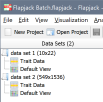
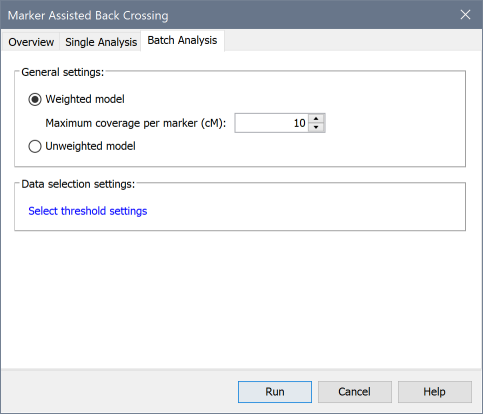
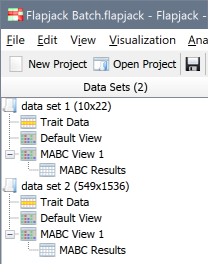
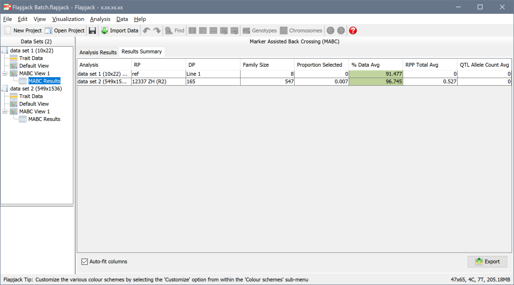
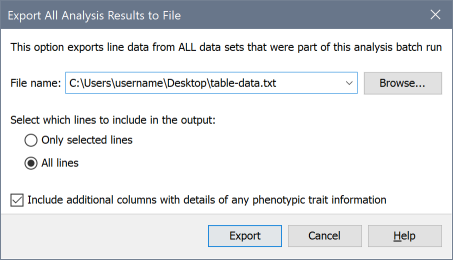
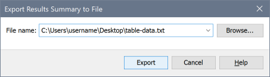

Batch Analysis
==============

Flapjack can run certain analysis methods in a batch mode, which allows you to run that analysis for all open data sets (and views) in the current project.

This applies to

- :doc:`mabc`
- :doc:`pedver_f1s_known_parents`
- :doc:`pedver_lines`
- :doc:`forward_breeding`
- :doc:`ifb`

.. note::
  Batch analysis works the same way regardless of analysis type, so in the text below we will use :doc:`mabc` as an example.

Launching a batch analysis
--------------------------

Batch analysis only makes sense if you have multiple data sets (or multiple views within a data set) available, so first ensure you have at least two data sets that can be used:

 |BatchDatasets|

To launch a batch analysis, pick your analysis from the ``Analysis`` menu as normal, for example ``Analysis->Marker Assisted Back Crossing``, and ensure that the ``Batch Analysis`` tab has been selected:

 |BatchLaunch|

.. note::
  The options you see here will differ depending on the chosen analysis type.

.. important::
  You may see less options here compared to running a single analysis. This is because data set specific parameters - such as choosing parental lines - cannot be selected when running a batch analysis. Flapjack will either use :doc:`pedigrees` in the originally imported raw data to make these selections for you, or will set the first and second lines found as parents.

Once you have made any parameter selected, launch the analysis using ``Run`` and - once complete - you will see that Flapjack has applied the analysis to each data set, and has creatied a view to hold the results for each one:

 |BatchDatasets2|

Working with batch analysis results
-----------------------------------

Flapjack will default to showing you the :doc:`analysis_results_tables` view for the last data set that it processed. This view is no different than the one you would have gotten had you run a Single Analysis for this data set, and you can switch between the various analysis runs by selecting them from the ``Data Sets`` navigation pane as normal.

To view the Batch Analysis Summary, you should select the second tab above the tab - ``Results Summary`` - which will give you a view similar to the following:

 |BatchSummaryView|

Here, each data set (or view) that was processed is listed, along with a summary of data side wide statistics, such as averages or minimum/maximums that apply to the various columns within the ``Analyis Results`` view for that data set.

.. tip::
  You can quickly jump to the ``Analyis Results`` view for any data set by **double clicking** its row within the ``Results Summary`` view.

Exporting data
--------------

The ``Export`` button provides you with two options for exporting data.

Export all analysis results to file
~~~~~~~~~~~~~~~~~~~~~~~~~~~~~~~~~~~

 |BatchExport1|

This dialog allows you to export to a single tab-delimited text file, all rows of the multiple ``Analyis Results`` tables that were produced by this batch run.

Export results summary to file
~~~~~~~~~~~~~~~~~~~~~~~~~~~~~~

 |BatchExport2|

This dialog allows you to export to a tab-delimited text file, the contents of the ``Results Summary`` view.