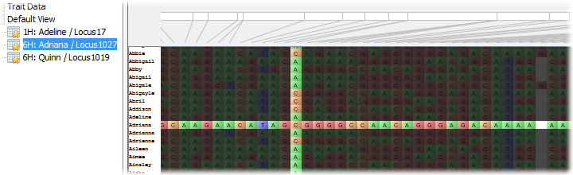

Bookmarks
=========

A bookmark in Flapjack is simply a tracked intersection between a line and a marker (and therefore the allele at that position). You can use bookmarks to track a specific allele of interest, or just a region of the screen in general by picking a specific point within it.

 |Bookmark|

Creating a bookmark
-------------------

To bookmark a, right-click an allele with the mouse, and then select ``Bookmark location`` from the popup menu that appears. The bookmark will then be added to the navigation tree on the left-hand side of the screen, underneath the node for the current view.

 |BookmarkMenu|

Returning to a previously created bookmark

To return to a bookmark, simply select it from the navigation tree. Flapjack will adjust the current view to show the correct chromosome for that bookmark, and will graphically highlight the line and marker intersection for a few seconds.

Deleting bookmarks
------------------

To delete a bookmark, right-click it with the mouse and then select ``Delete bookmark`` from the popup menu that appears.

.. |BookmarkMenu| image:: images/BookmarkMenu.png
