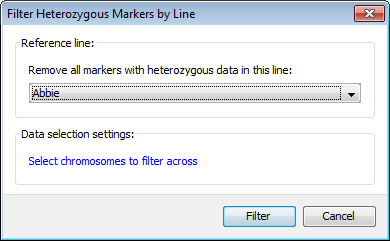
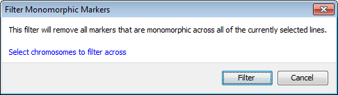

Filtering Markers
=================

You can filter markers in one of four ways, with all methods accessible via the ``Edit->Filter markers`` menubar option.

Note that any filter options will only apply to the currently selected set of markers, so you may wish to confirm marker selection before choosing one of these options, and/or modifying the filter by choosing to include or exclude entire chromosomes using the ``Select chromosomes to filter across`` option, located within each of the filter dialogs.

Filter missing markers
----------------------

 |FilterMissingMarkers|

Use the dialog to select a percentage cutoff to filter markers with missing data.

Filter missing markers by line
------------------------------

 |FilterMissingMarkersByLine|

Use the dialog to select which line should be used; any markers with missing data for that line (and only that line) will be hidden from view. Note that if you right-click a line on the main visualization view, then select this filter from the pop up menu, the line will then be preselected in the dropdown.

Filter heterozygous markers by line
-----------------------------------
 |FilterHetMarkersByLine|

Use the dialog to select which line should be used; any heterozygous markers for that line (and only that line) will be hidden from view. Note that if you right-click a line on the main visualization view, then select this filter from the pop up menu, the line will then be preselected in the dropdown.

Filter monomorphic markers
--------------------------

 |FilterMonoMarkers|

This filter will remove all markers that are monomorphic across all of the currently selected lines.

.. |FilterMissingMarkers| image:: images/FilterMissingMarkers.png
.. |FilterMissingMarkersByLine| image:: images/FilterMissingMarkersByLine.png

