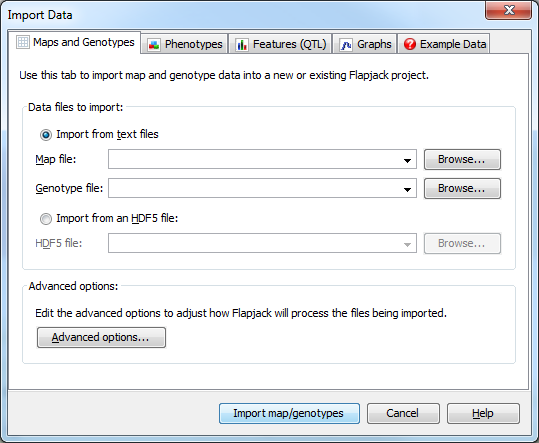
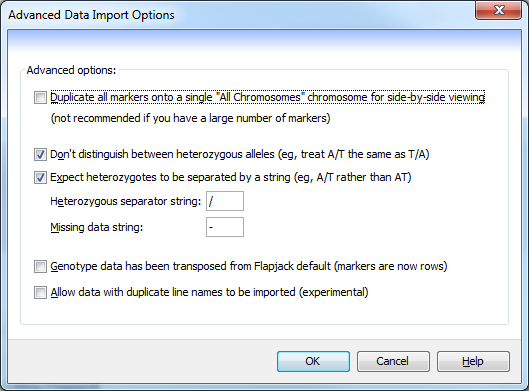

Import Data
===========

The ``Import Data`` dialog (``File->Import data``) is used to provide information on data files should be used to import data into Flapjack. 

Importing data
--------------

The ``Maps and Genotypes`` tab is used to specify the map file and genotype file to load into Flapjack. With the ``Import from text files`` radio button selected, use the browse buttons to locate and select the map and genotype files you wish to load into Flapjack.

 |DataImportDialog|

The **map file** should contain information on the markers, the chromosome they are on, and their position within that chromosome. The markers do not need to be in any particular order as Flapjack will group and sort them by chromosome and distance once they are loaded. A short example is shown below:

::

 # fjFile = MAP
 Marker1      1H     32.5
 Marker2      1H     45.0
 Marker3      2H     23.9

The **genotype file** should contain a list of variety lines, with allele data per marker for that line. It also requires a header line specifying the marker information for each column.

::

 # fjFile = GENOTYPE
              Marker1   Marker2   Marker3
 Line1        A         G         G
 Line2        A         -         G/T
 Line3        T         A         C

Both the map file and the genotype file must be in plain-text, tab-delimited format. The ``\# fjFile =`` header lines are optional (but recommended) as they allow the files to be loaded into Flapjack via drag
and drop. Once you have specified the map and genotype file you wish to load click the ``Import map/genotypes`` button to import your data.

Clicking the ``Advanced options...`` button opens the ``Advanced Data Import Options`` dialog.

Advanced data import options
----------------------------
This dialog is used to tweak how the basic Flapjack data import behaves.

 |AdvancedDataImportDialog|

The advanced data import options are:

* ``Duplicate all markers onto a single "All Chromosomes" chromosome for side-by-side viewing`` - selecting this option creates an additional "chromosome" which can be selected from the Chromosome dropdown menu on the toolbar. Each chromosome is laid out one after another, with a set of empty dummy markers denoting the end of one chromosome and the beginning of another. This allows you to see the genotypes for the entire dataset together. This is not reccommended when you have very large numbers of markers.
* ``Don't distinguish between heterozygous alleles (eg, treat A/T the same as T/A)`` - select this option to ensure that duplicate heterozygous alleles are replaced while importing the genotypes. For example, all instances of T/A would be replaced by A/T (or vice versa), so that the final data only contains A/T alleles.
* ``Expect heterozygotes to be separated by a string`` - this tells Flapjack to look for heterozygotes that are separated by a specific character (defined below). If your data is of the form A/T then this should be used, however, if the data defines AT as a heterozygote then this option should be deselected.
* ``Heterozygous separator string`` - this specifies the string that is used to define heterozygous alleles within the data.
* ``Missing data string`` - this specifies the string that is used to define missing genotype data. It can be left blank if no character is used within the genotype file.
* ``Genotype data has been transposed from Flapjack default (markers are now rows)``- selecting this option requires effectively swaps the header row with the first column in a genotype file, i.e. line names in the header row and marker names in the first column.
* ``Allow data with duplicate line names to be imported (experimental)`` - older versions of Flapjack didn't allow the importing of data with duplicate line names. It is now possible - but not reccomended - to import data with duplicate line names.

