Marker Assisted Back Crossing Tutorial
======================================

We will assume that you are using the ``gobii-test`` dataset, which contains simulated data in an A/B format. MABC analysis in Flapjack is not limited to this style of data and works with standard nucleotide data as well. Feel free to follow along either using the dataset as provided, or with your own data.

Tutorial data
-------------

In this tutorial you'll be working with three files, a map file (gobii-test.map) which contains a set of 61 markers across 4 chromosomes, a genotype file (gobii-test.dat) which contains data on a set of 202 lines (one recurrent parent, one donor parent and 200 crosses), and a QTL file (gobii-test.qtl) which contains data on 2 QTL.

Download the data  (Right click->Save Link As...):

* `gobii-test.map`_
* `gobii-test.dat`_
* `gobii-test.qtl`_

Importing data
--------------

To import data into Flapjack click the ``Import Data`` button on the toolbar. In the ``Import Data`` dialog, select the ``Maps and Genotypes`` tab, then click ``Browse`` to navigate to and select the map file you wish to import (gobii-test.map), and then do the same for the genotype file you wish to import (gobii-test.dat).

 |001-import-map-geno|
 
Click the ``Advanced options`` button to open the ``Advanced Data Import Options`` dialog and ensure that the ``Duplicate all markers onto a single "All Chromosomes" chromosome for side by side viewing`` option is selected, then click OK. Finally click the ``Import map/genotypes`` button to load the data.

You should now be viewing the Default View on the 1st chromosome of your dataset. This is the main type of visualization in Flapjack and comprises a graphical genotype view of the imported data. Each square represents an allele, found at the cross-section of a line and a marker, lines or varieties can be found down the left hand side of the display and markers can be found along the top (as well as a visualization of the map associated with the markers). Alleles can be either homozygous (in this dataset either an A or a B) or heterozygous, with the latter being rendered as split diagonal blocks, or A/B in the dataset.

 |002-initial-default-view|
 
If you're used to viewing heterozygous alleles as simply H instead of a diagonal split view, select ``Visualization->Colour scheme->Customize...`` from the menubar to open the ``Customize Colours`` dialog. From there you can select ``Always render heterozygotes as single-colour "H" blocks, regardless of the scheme selected`` option and click ``Apply to current view`` - your heterozygotes should now be rendering as a single-colour 'H' block.

 |005-hets-as-h|
 
Next, click the ``Import Data`` button again and this time select the ``Features (QTL)`` tab. Browse for and select the QTL file associated with your dataset (gobii-test.qtl), then click ``Import features``. You should now be viewing the Trait Data view on the Quantitative Trait Loci (QTLs) tab which gives a summary view of the imported QTLs.

 |003-import-qtl|
 
Click Default View from the navigation tree to return to the visualization of genotype data. Select the All Chromosomes view from the Chromosome dropdown menu underneath the toolbar and use the zoom control at the bottom of the display to zoom out until you can see all of the data. You should now see a representation of all four chromosomes in the dataset, including the two QTL you imported, one on chromosome 1 and the other on chromosome 4.

 |004-qtl-loaded-all-chromosomes|
  
The QTL in this case are the red rectangles above the maps on the All Chromosomes view. The markers under a QTL are highlighted by yellow boxes just above the genotype display. Now that you have loaded and viewed all of the data required to run a marker assisted backcrossing analysis, it’s time to explore the data and filter out any undesirable markers before running the analysis.

Exploring and filtering data
----------------------------

To navigate the data select ``Edit->Navigation mode`` from the menubar, then click and drag the main display around with your mouse to examine all of your data. You can also use the scrollbars to navigate the data, as well as clicking and dragging on the overview in the bottom left. To zoom you can either use the zoom slider in the bottom left of the display, double click on the main display to zoom in, or use ctrl /cmd and the mouse’s scroll-wheel to zoom in and out.

Before you run a marker assisted backcrossing analysis, you may want to filter out markers with lots of missing data, or monomorphic markers. Select ``Edit->Filter markers->Missing markers...`` to open the ``Filter Missing Markers`` dialog. Choose the percentage of missing data in a marker required to filter out a marker, then use the ``Filter`` button to perform the operation. You should see a message detailing the number of markers that were filtered out of the dataset as part of the operation. (Note that in the case of the sample dataset none will be filtered out as no markers have a high percentage of missing data in the simulated dataset.)

The procedure for filtering monomorphic markers is very similar - select ``Edit->Filter markers->Monomorphic markers``, and simply apply the filter once the dialog has opened.

It’s also possible to filter out markers which have missing (or heterozygous) data in a given line. To do this, right click on a line of interest and and select ``Filter markers->Missing markers (by line)`` to open the ``Filter Missing Markers by Line`` dialog. The line should be pre-selected in the dropdown menu. Click ``Filter`` and Flapjack will remove any markers which have missing data for this line from the display.

Running the analysis
--------------------

Select ``Analysis->Marker assisted backcrossing`` to open the ``MABC Statistics`` dialog. Select the recurrent parent line for your data from the first drop down list and the donor parent line from the second drop down list. The drop down lists automatically select the first and second lines of the genotype input file, so if as in the tutorial data set, your recurrent and donor parent are on the first and second lines of the input file they will be automatically selected. Now select ``Weighted model`` if it is not already selected, and set the ``Maximum coverage per marker`` to 10. This means we've specified that each marker can accurately represent 10cM (5 cM either side of the marker) of the genome.

 |006-mabc-stats-dialog|

Click ``Run`` and Flapjack will run the marker assisted backcrossing statistics on your data.

Viewing the analysis results
----------------------------

Once the analysis has completed you should see a table of results. The results table will contain the lines that you included in the analysis, for each line it will have values for the RPP (Recurrent Parent Proportion) for each chromosome, as well as an RPP total value which measures RPP across all chromsomes, an RPP coverage value, then a linkage drag and status for each QTL, an overall QTL allele count, as well as a selected state, rank and comment. The final column - Don't Sort / Filter - allows you to mark lines that you don't want table sorts and filters to apply to. By default, Flapjack sets both the recurrent and donor parent to neither sort, nor filter. This has the effect of keeping them in the display and always at the top of the table of data.

 |007-mabc-results|

You should see that not only has Flapjack generated this ``MABC Results`` view, but it has linked this to a new view called ``MABC View 1``. Click ``MABC View 1`` to view it and you should see that it's a clone of the ``Default View``, but has the ``By similarity to line (2 colour)`` colour scheme applied. This colour scheme colours a reference line all green, all other lines have their alleles coloured either green, if they match the reference line, or red, if they don't match the reference line. In this particular case the alleles will be coloured relative to the recurrent parent line you chose when you ran the marker assisted backcrossing analysis. This view ``MABC View 1`` is linked to the table in the ``MABC Results`` view. That means moving lines, sorting lines, selecting lines and hiding lines on ``MABC View 1`` does the same in the linked ``MABC Results`` view, and sorting lines, selecting lines and filtering lines in the ``MABC Results`` view does the same in the linked view ``MABC View 1``.

 |008-mabc-view-1|

Filtering the results
---------------------

Click on ``MABC Results`` to return to the results view. Next click ``Filter->Filter`` to open the ``Filter Table`` dialog. You should see a table with a list of columns from the table on which you can filter. Click on the filter column for the row called ``Status (QTL1)`` and select ``Greater than or equal to`` from the drop down list. Next enter a value of ``1`` in the adjacent ``Value`` column. Do the same for ``Status (QTL2)``, then click ``Filter``. 

 |009-filter-table-dialog|

You should see that the results table has filtered out lines which didn't match the filter criteria. In fact only 37 lines matched the filter criteria.

 |010-filtered-results|

Click on ``MABC View 1`` if you want to see what the lines which have been kept look like visually.

 |011-filtered-genotypes|

Sorting the results
-------------------

Return to the results table and select ``Sort`` to use the ``Advanced Sort`` dialog. Click ``Add sort level`` twice to add two more entires to the table. Click the first entry in the ``Column`` column and select ``RPP Total`` from the drop down list that appears. For the next two entries select LD (QTL1) and LD (QTL) respectively. Finally for the last two entries change their ``Order`` to be ``Smallest to largest``. Click ``Sort`` to sort the data. You should see that the data in the table and in the genotypes view has been sorted according to your criteria.

 |012-sorted-results|

 |013-sorted-genotypes|

Selecting within results
------------------------

Click ``Select->Auto select`` to open the ``Auto Select Lines`` dialog. Fill the dialog in as with the ``Filter`` dialog, with values for ``RPP Total`` of ``Greater than or equal to`` ``0.6``, ``LD (QTL1)`` of ``Less than or equal to`` ``62``, and ``LD (QTL2)`` of ``Less than or equal to`` ``34``. Click ``Select`` to apply the selection criteria to the data in the results table. You may see a dialog informing you that Flapjack has switched to line mode. Click Ok to dismiss this. Then view the results of your selection in both the results and genotype views. You should note that there are now only 15 lines selected. Deselected lines are de-emphasised in the genotype view in Flapjack by ligthening their colour. 

 |014-auto-select-lines|

 |015-selected-results|

 |016-selected-genotypes|
 

Ranking results
---------------

Looking at the selected lines in the results table a little more closely, two lines in particular stand out for having particularly low LD values for both QTL in the data set. It may be worthwhile marking these up of being particular interest. CTRL/CMD click on the rows for ``RP[1]/DP-176`` and ``RP[1]/DP-68`` in the table to highlight these rows. Click the ``Rank`` button to open the ``Rank Lines`` dialog. As all other lines in the data set currently have the default rank of 0, leave the value in the ``Assign all highlighted lines a rank of`` field as 1 and click ``OK``. The rank for the highlighted rows will be updated to 1. You can also click on the comment field for each line and type a descriptive comment about the line, perhaps explaining why it's been given a particular rank.

 |017-rank-results|
 

Exporting results
-----------------

Click ``Export`` to open the ``Export Results to File`` dialog. You can select three separate types of export from this dialog, ``All lines`` which exports all of the data whether it had been filtered or not, ``Only visible (non-filtered) lines`` which outputs the results table as it appears in Flapjack, and ``Only visible (non-filtered) lines that are selected`` which outputs only the lines which are visible in the table and are selected. Select the third option: ``Only visible (non-filtered) lines that are selected``. Ensure that the ``Include header rows with details of any active filter or sort parameters`` is selected, this outputs information about the filtering and sort that was applied to reach the current view of the data, which can be useful for the purpose of reproducing the steps at a later date. Click ``Browse`` to select a location to save your file, as well as a file name. Finally click ``Export`` to output the data to file.

 |018-export-results-to-file|

You can view the contents of the file in any text editor. 

Viewing results in the genotype view
------------------------------------

Return to the genotype view of the data (``MABC View 1``) and zoom in until you can comfortably read the line names which are just to the left of the genotype visualization. Right-click on the list of line names and select ``Show table results`` from the menu to open the ``Columns To Display`` dialog. This dialog allows you to select columns of data from the results table to view side by side with the genotype data. This can be good for a final visual validation of what you're seeing from the analysis results. Select ``RPP Total``, ``LD (QTL1)``, ``LD (QTL2)`` and ``QTL Allele Count`` by clicking the corresponding checkboxes in the dialog, then click ``OK``.

 |019-columns-to-display|

 |020-results-linked-to-genotypes|

You should see that there are four extra columns of data between the lines names and the genotype display. These are the four columns you selected in the ``Columns To Display`` dialog and represent the data found for those columns for the lines in ``MABC Results`` view. Mouseover the columns to see tooltips with the column name and value for the line under the mouse, this information is also displayed in the status panel at the bottom of the display.

Conclusion
----------

You've now had a chance to experiment with running a markers assisted backcrossing analysis in Flapjack and analysing the results of that analysis. Feel free to experiment more by applying different sorts, filters, selections, or better yet make a start on analysing your own data.

.. _`gobii-test.map`: http://bioinf.hutton.ac.uk/flapjack/sample-data/tutorials/gobii-test.map
.. _`gobii-test.dat`: http://bioinf.hutton.ac.uk/flapjack/sample-data/tutorials/gobii-test.dat
.. _`gobii-test.qtl`: http://bioinf.hutton.ac.uk/flapjack/sample-data/tutorials/gobii-test.qtl

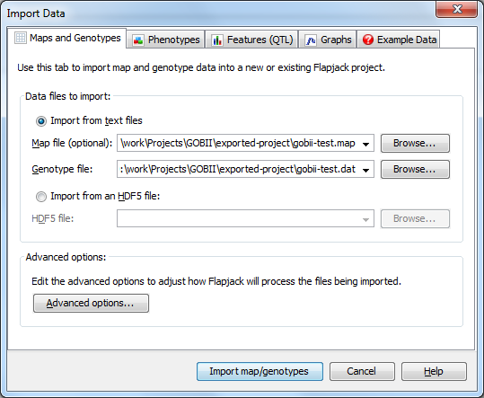
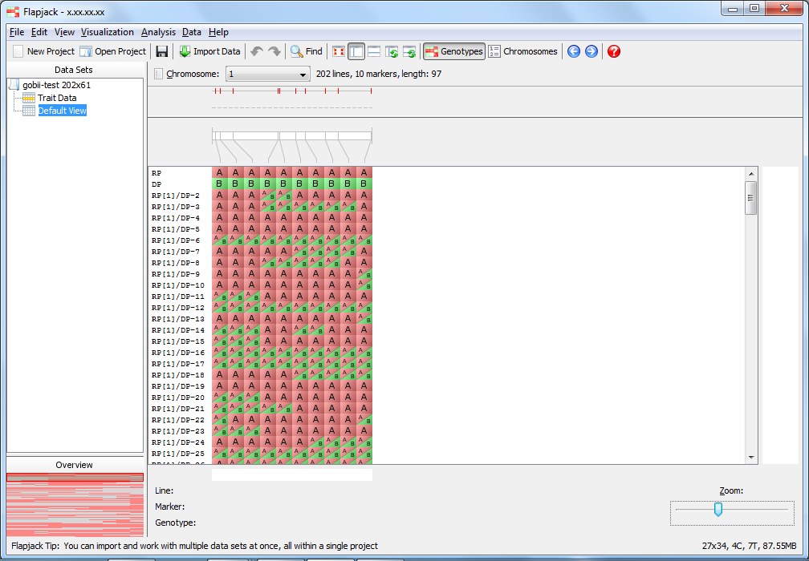
.. |005-hets-as-h| image:: images/mabc_tut/005-hets-as-h.png
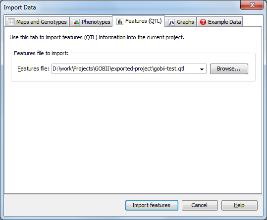
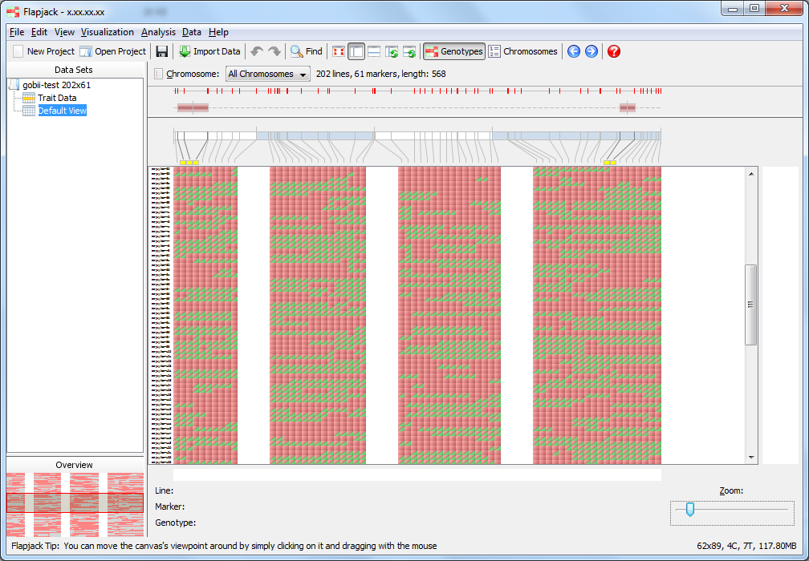
.. |006-mabc-stats-dialog| image:: images/mabc_tut/006-mabc-stats-dialog.png
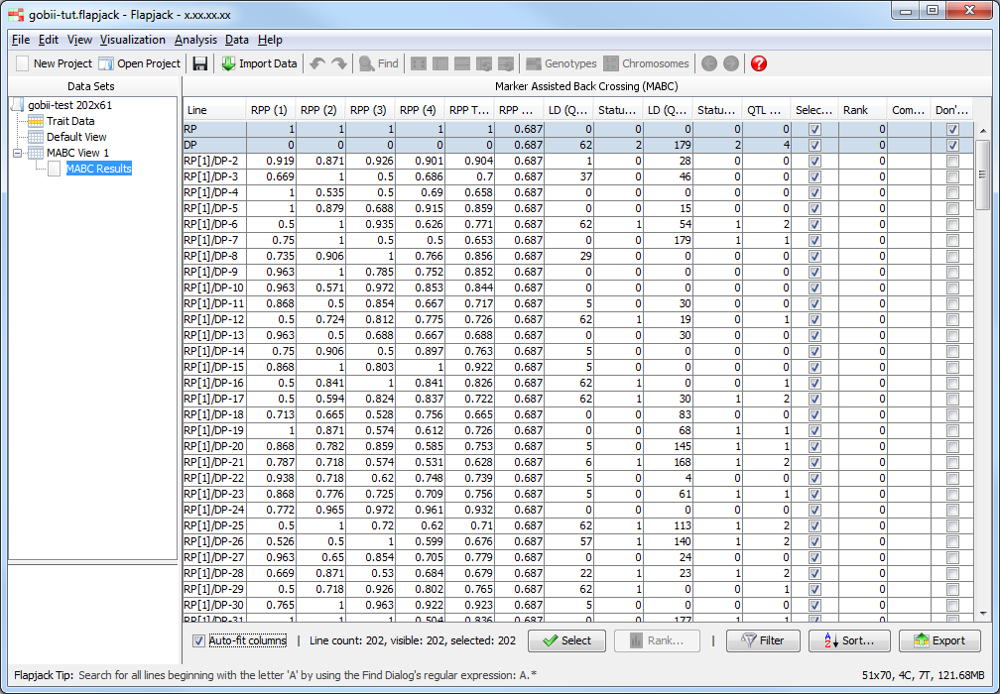
.. |008-mabc-view-1| image:: images/mabc_tut/008-mabc-view-1.png
.. |009-filter-table-dialog| image:: images/mabc_tut/009-filter-table-dialog.png
.. |010-filtered-results| image:: images/mabc_tut/010-filtered-results.png
.. |011-filtered-genotypes| image:: images/mabc_tut/011-filtered-genotypes.png
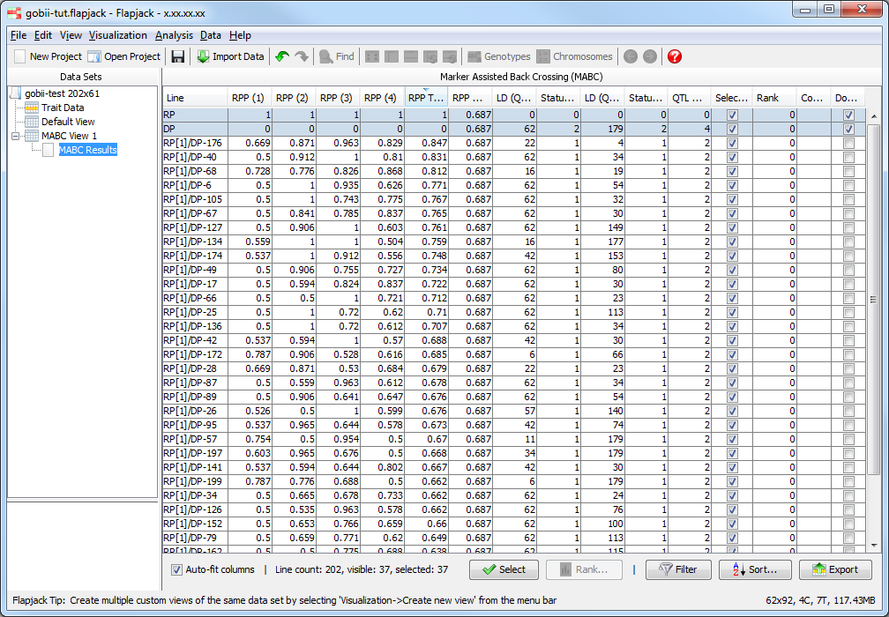
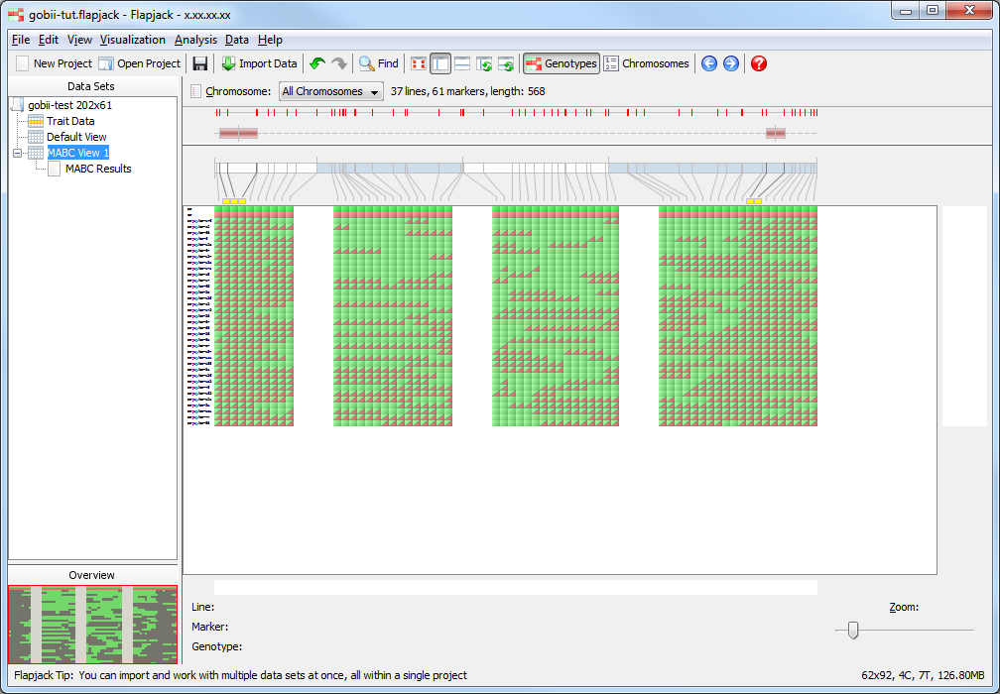
.. |014-auto-select-lines| image:: images/mabc_tut/014-auto-select-lines.png
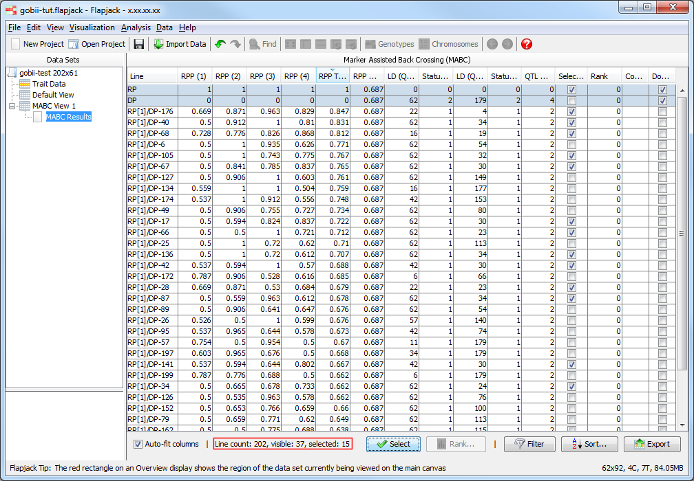
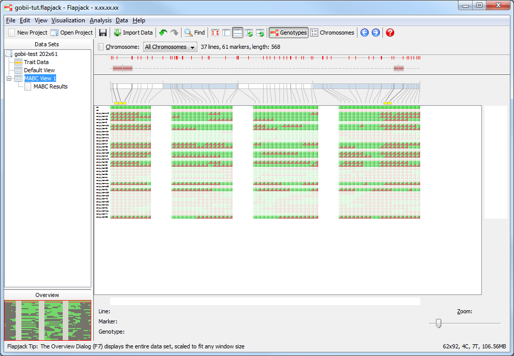
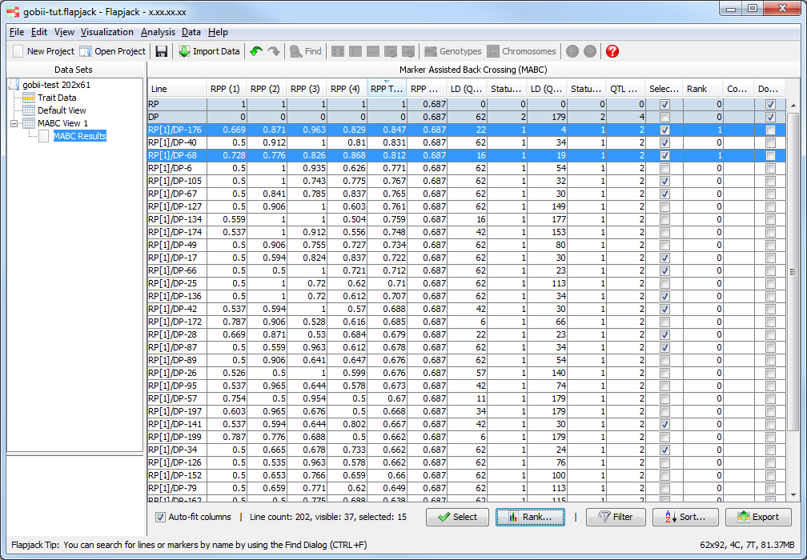
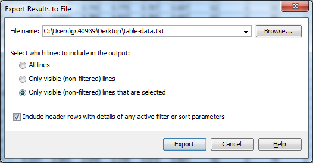
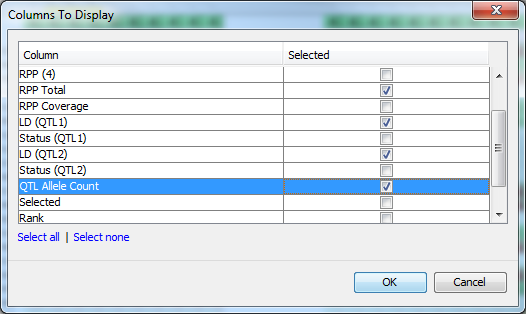
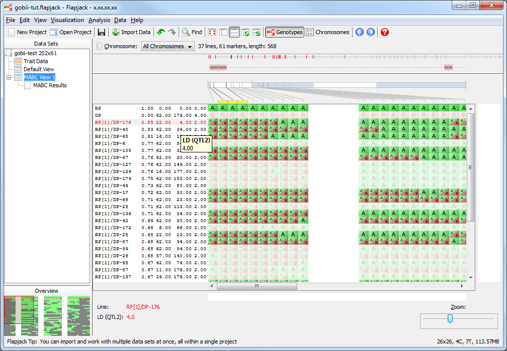