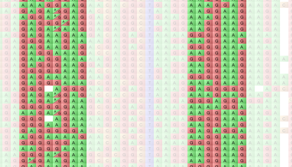

Modes and Views
===============

Flapjack has two main visualization modes: :doc:`genotype_visualization` and :doc:`chromosome_visualization`.

Within ``Genotype Visualization`` there are three further submodes of working.

Navigation mode
---------------

 |NavigationMode|

In ``Navigation Mode`` the Flapjack canvas responds to mouse interaction by allowing you to click and drag and canvas around. The selection state of lines and markers is not shown in the this mode.

Select Navigation Mode by using ``Edit->Navigation mode`` from the menubar or pressing the ``Navigation mode`` toolbar button.

Marker mode
-----------

 |MarkerMode|

In ``Marker mode`` Flapjack will display the selection state of markers. By default, all markers are selected (painted normally). Any deselected markers are painted in a fainter colour. You can toggle the selection state of one or more markers by clicking on it, or by click-dragging across multiple markers. In Marker Mode, a CTRL+Double Click (or CMD on macOS) can be used to hide an individual marker.

 |MarkerModeExample|

Select Marker Mode by using ``Edit->Marker mode`` from the menubar or pressing the ``Marker mode`` toolbar button.

Line mode
---------

 |LineMode|

In ``Line mode`` Flapjack will display the selection state of lines. By default, all lines are selected (painted normally). You can toggle the selection state of one or more lines by clicking on it, or by click-dragging across multiple lines. In Line Mode, a CTRL+Double Click (or CMD on macOS) can be used to hide an individual line.

Select Line Mode by using ``Edit->Line mode`` from the menubar or pressing the ``Line mode`` toolbar button.

.. |NavigationMode| image:: images/NavigationMode.png
.. |MarkerMode| image:: images/MarkerMode.png
.. |LineMode| image:: images/LineMode.png