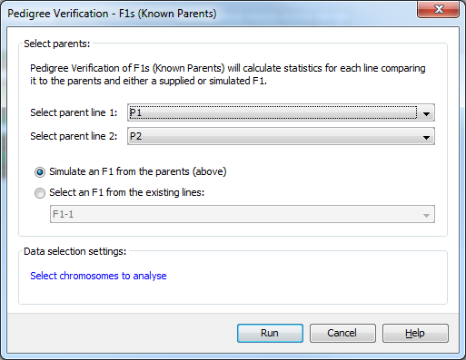

Pedigree Verification Lines (parental contribution)
===================================================

This analysis provides several key statistics to determine whether a sampled line is a progeny of the expected, or designated, parents. 

In addition to this help page, you can also read the :doc:`pedver_lines_tut`, which runs through the process of running the analysis and viewing the results with a sample dataset.

 |PedVerF1sKnownParentsDialog|

Using the ``Pedigree Verification - Lines (parental contribution``) dialog you can select the two parental lines that you are comparing sampled lines against. 

The following statistics are provided;

* ``Data count`` - the number of markers with non-missing values.

* ``% Data`` - the number of markers with non-missing values as a percent of the total markers for a sample.

* ``Het count`` - the number of markers with heteozygous genotypes (i.e. alleles that differ) for a sample.

* ``% Het`` - the number of markers with heteozygous genotypes as a percent of the total markers for a sample.

* ``% Allele Match to P1``  - alleles matching between the sampled line and the parent line, as a percentage of non-missing data in both the sampled line and P1, across all markers for a sample. e.g. Sampled line = A/T, C/C and P1 = A/T, C/T is a 75% match.

* ``% Allele Match to P2`` - alleles matching between the sampled line and the parent line, as a percentage of non-missing data in both the sampled line and P2, across all markers for a sample. e.g. Sampled line = A/A, C/T and P2 = A/T, C/T is a 75% match.

* ``% Allele Match to P1 / P2`` - alleles in the sampled line that match an allele in EITHER P1 OR P2, as a percentage of non-missing data in both the sampled line and either parent, across all markers for a sample. e.g. Sampled line = A/T C/C, P1 = T/T C/G and P2 = T/T C/C is a 75% match.

These statistics can be used to filter results;

* ``Data Count and % Data`` - since for many pedigree tests a small number of markers are used, the results can first be filtered by ``Data Count`` or ``% Data`` to eliminate potentially skewed results.

* ``% Het`` - % het data can be used to assess whether the expected generation has been sampled eg if sampling is on fixed lines, and a sampled line has unexpectedly high hets, this line could be filtered out from being selected.   

