Pedigree Verification - Lines (parental contribution) Tutorial
==============================================================

In this tutorial we will assume that you are using the ``ped-ver-tutorial`` dataset, which contains simulated data with two parent lines and four sampled lines that we will compare against these parental lines to see if they are likely to be derived from them. You'll be working with two files, a map file (ped-ver-tutorial.map) which contains a set of 35 markers across 4 chromosomes and a genotype file (ped-ver-tutorial.dat) which contains data on a set of 6 lines (two of which are parents, 4 of which are sampled lines).

Download the data (Right click->Save Link As):

* `ped-ver-lines.map`_
* `ped-ver-lines.dat`_

Importing data
--------------

To import data into Flapjack click the ``Import Data`` button on the toolbar. In the ``Import Data`` dialog, select the ``Maps and Genotypes`` tab, then click ``Browse`` to navigate to and select the map file you wish to import (ped-ver-tutorial.map), and then do the same for the genotype file you wish to import (ped-ver-tutorial.data).

 |001-pv-import-data|

Click the ``Advanced options`` button to open the ``Advanced Data Import Options`` dialog and ensure that the ``Duplicate all markers onto a single “All Chromosomes” chromosome for side by side viewing`` option is selected. Make sure your heterozygous string seperator is blank, and your missing data string is -. Click OK.
Finally click the ``Import map/genotypes`` button to load the data.

You should now be viewing the Default View for your chromosomes. This is the main type of visualization in Flapjack and comprises a graphical genotype view of the imported data. Each square represents a genotype call, found at the cross-section of a line and a marker, lines or varieties can be found down the left hand side of the display and markers can be found along the top (as well as a visualization of the map associated with the markers). Alleles can be either homozygous or heterozygous, with the latter being rendered as split diagonal blocks. 

 |002-pv-initial-default-view|

If you’re used to viewing heterozygous alleles as simply H instead of a diagonal split view, select ``Visualization->Colour scheme->Customize`` from the menubar to open the ``Customize Colours`` dialog. From there you can select ``Always render heterozygotes as single-colour 'H' blocks, regardless of the scheme selected`` option and click ``Apply to current view`` - your heterozygotes should now be rendering as a single-colour 'H' block.

 |005-hets-as-h|

Exploring and filtering data
----------------------------

To navigate the data select ``Edit->Navigation mode`` from the menubar, then click and drag the main display around with your mouse to examine all of your data. You can also use the scrollbars to navigate the data, as well as clicking and dragging on the overview in the bottom left. To zoom you can either use the zoom slider in the bottom left of the display, double click on the main display to zoom in, or use ctrl /cmd and the mouse’s scroll-wheel to zoom in and out.

Before you run an analysis, you may want to filter out markers with lots of missing data, or monomorphic markers. Select ``Edit->Filter markers->Missing markers`` to open the ``Filter Missing Markers`` dialog. Choose the percentage of missing data in a marker required to filter out a marker, then use the ``Filter`` button to perform the operation. You should see a message detailing the number of markers that were filtered out of the dataset as part of the operation.

The procedure for filtering monomorphic markers is very similar - select ``Edit->Filter markers->Monomorphic markers``, and simply apply the filter once the dialog has opened.

It’s also possible to filter out markers which have missing (or heterozygous) data in a given line. To do this, right click on a line of interest and and select ``Filter markers->Missing markers (by line)`` to open the ``Filter Missing Markers by Line`` dialog. The line should be pre-selected in the dropdown menu. Click ``Filter`` and Flapjack will remove any markers which have missing data for this line from the display.

Running the analysis
--------------------

Select ``Analysis->Pedigree verification->Lines (parental contribution)`` . Select the first parent line for your data from the first drop down list and the second parent line from the second drop down list. The drop down lists automatically select the first and second lines of the genotype input file, so if as in the tutorial data set, your two parents are on the first and second lines of the input file they will be automatically selected. 

 |004-pv-analysis-dialog|

Click ``Run`` and Flapjack will run the analysis.

Viewing the analysis results
----------------------------

Once the analysis has completed you should see a table of results. The results table will contain the lines that you included in the analysis, for each line it will have a data count, percentage of data, count of heterozygotes, percentage of heterozygotes, percentage match to parent 1 alleles, percentage match to parent 2 alleles, and percentage match to either P1 or P2 alleles, as well as a selected state, rank and comments. The final column - Don't Sort / Filter - allows you to mark lines that you don't want table sorts and filters to apply to. By default, Flapjack sets both of the parents to neither sort, nor filter. This has the effect of keeping them in the display and always at the top of the table of data.

 |005-pv-analysis-results|

You should see that not only has Flapjack generated this ``PedVerLines Results`` view, but it has linked this to a new view called ``PedVer Lines View``. Click ``PedVer Lines View`` to view it and you should see that it's a clone of the ``Default View``, but has the ``By similarity to either parent (alleles)`` colour scheme applied. This colour scheme colours the alleles in the selected parent lines  grey so that they can be distinguished from the colour scheme in the sampled lines. For the sampled lines, all alleles that match alleles in *either* parent are colored green, or, if they don't match alleles in *either* parent are colored red. This view ``PedVerLines View`` is linked to the table in the ``PedVer LInes Results`` view. That means moving lines, sorting lines, selecting lines and hiding lines on ``PedVer Lines View`` does the same in the linked ``PedVerLines Results`` view, and sorting lines, selecting lines and filtering lines in the ``PedVerLines Results`` view does the same in the linked view ``PedVer Lines View``.

 |006-pv-pedverf1s-view|

Filtering the results
---------------------

Click on ``PedVerLines Results`` to return to the results view. Next click ``Filter->Filter`` to open the ``Filter Table`` dialog. You should see a table with a list of columns from the table on which you can filter. Click on the filter column for the row called ``% Data`` and select ``Greater than`` from the drop down list. Next enter a value of ``90`` in the adjacent ``Value`` column, then click ``Filter``. 

 |007-pv-filter-dialog|

You should see that the results table has filtered out lines which didn't match the filter criteria. 3 of the 4 lines matched the criteria.

 |008-pv-filtered-results|

Click on ``PedVer LInes View 1`` if you want to see what the lines which have been kept look like visually.

 |009-pv-filtered-genotypes|

Sorting the results
-------------------

Return to the results table and select ``Sort`` to use the ``Advanced Sort`` dialog. Click ``Add sort level`` to add another entry to the table. Click the first entry in the ``Column`` column and select ``% Allele Match to P1 / P2`` from the drop down list that appears.  Click ``Sort`` to sort the data. You should see that the data in the table and in the genotypes view has been sorted according to your criteria.

 |010-pv-sorted-results|

 |011-pv-sorted-genotypes|

Selecting within results
------------------------
Return to the results table and select ``Select`` to use the ``Autoselect`` dialog. In ``% Allele Match to P1 / P2`` add criteria 'greater than or equal to' and value 90. Click select, and you will see in your analyses table that only lines with > 90% Allele Match to P1 and P2 have been selected. The fourth line with < 90% match is not selected. This information can now be exported to allow for selection in the field. 

Exporting results
-----------------

Click ``Export`` to open the ``Export Results to File`` dialog. You can select three separate types of export from this dialog, ``All lines`` which exports all of the data whether it had been filtered or not, ``Only visible (non-filtered) lines`` which outputs the results table as it appears in Flapjack, and ``Only visible (non-filtered) lines that are selected`` which outputs only the lines which are visible in the table and are selected. Select the third option: ``Only visible (non-filtered) lines that are selected``. Ensure that the ``Include header rows with details of any active filter or sort parameters`` is selected, this outputs information about the filtering and sort that was applied to reach the current view of the data, which can be useful for the purpose of reproducing the steps at a later date. Click ``Browse`` to select a location to save your file, as well as a file name. Finally click ``Export`` to output the data to file.

 |018-export-results-to-file|

You can view the contents of the file in any text editor.

Viewing results in the genotype view
------------------------------------

Return to the genotype view of the data (``PedVer LInes View``) and zoom in until you can comfortably read the line names which are just to the left of the genotype visualization. Right-click on the list of line names and select ``Select table results`` from the menu to open the ``Columns To Display`` dialog. This dialog allows you to select columns of data from the results table to view side by side with the genotype data. This can be good for a final visual validation of what you're seeing from the analysis results. Select ``% Allele Match to P1``, ``% Allele Match to P2``, and ``% Allele Match to P1 / P2`` by clicking the corresponding checkboxes in the dialog, then click ``OK``.

 |015-pv-columns-to-display|

 |016-result-linked-to-genotypes|

You should see that there are three extra columns of data between the lines names and the genotype display. Mouseover the columns to see tooltips with the column name and value for the line under the mouse, this information is also displayed in the status panel at the bottom of the display. 

Conclusion
----------

You've now had a chance to experiment with running a Pedigree Verification Lines analysis in Flapjack. Feel free to experiment more by applying different sorts, filters, selections, or better yet make a start on analysing your own data.

.. _`ped-ver-lines.map`: http://bioinf.hutton.ac.uk/flapjack/sample-data/tutorials/ped-ver-lines.map
.. _`ped-ver-lines.dat`: http://bioinf.hutton.ac.uk/flapjack/sample-data/tutorials/ped-ver-lines.dat

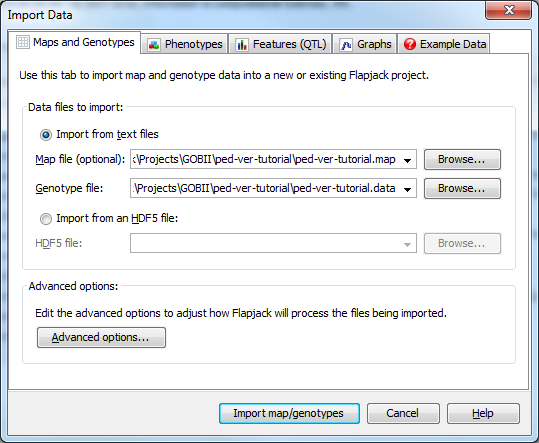
.. |002-pv-initial-default-view| image:: images/pedver_tut/002-pv-initial-default-view.png
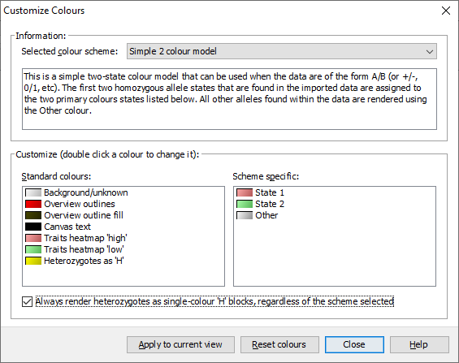
.. |003-pv-loaded-all-chromosomes| image:: images/pedver_tut/003-pv-loaded-all-chromosomes.png
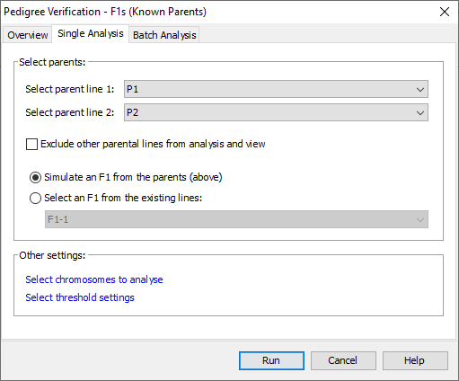
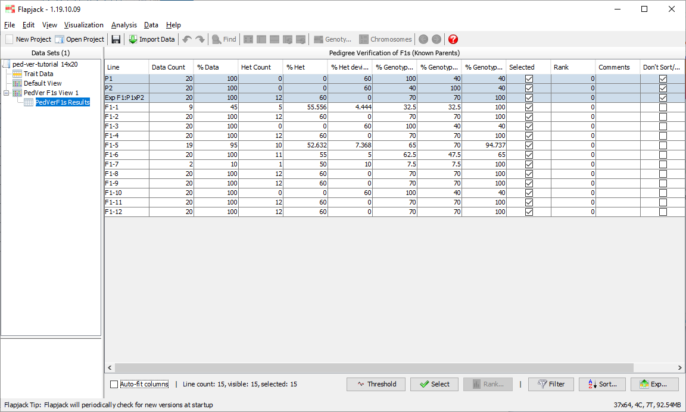
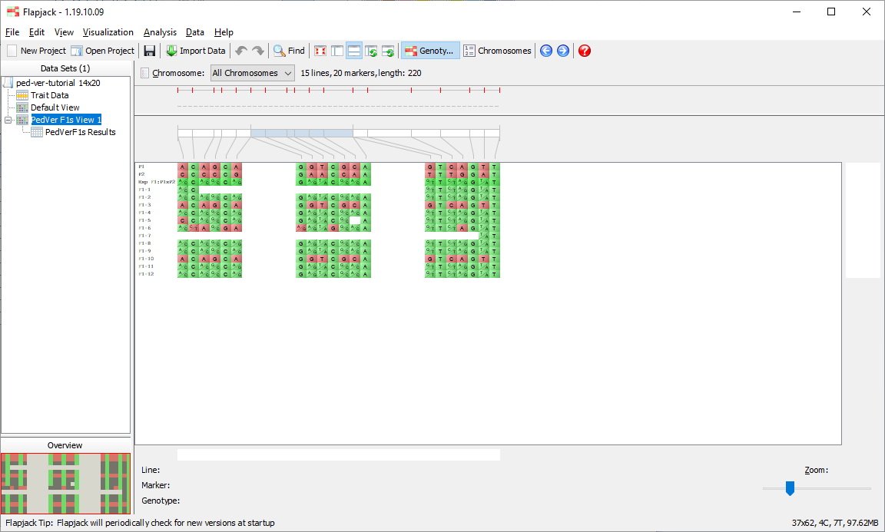
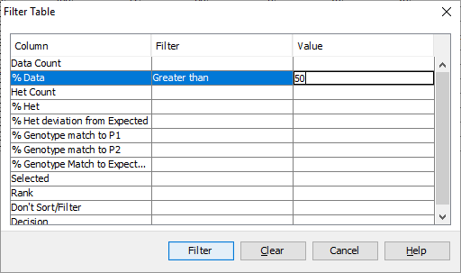
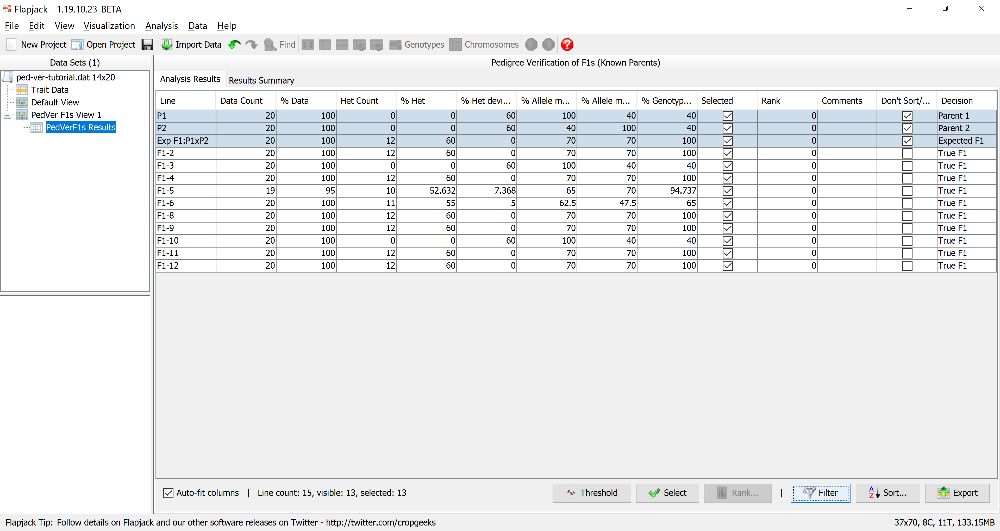
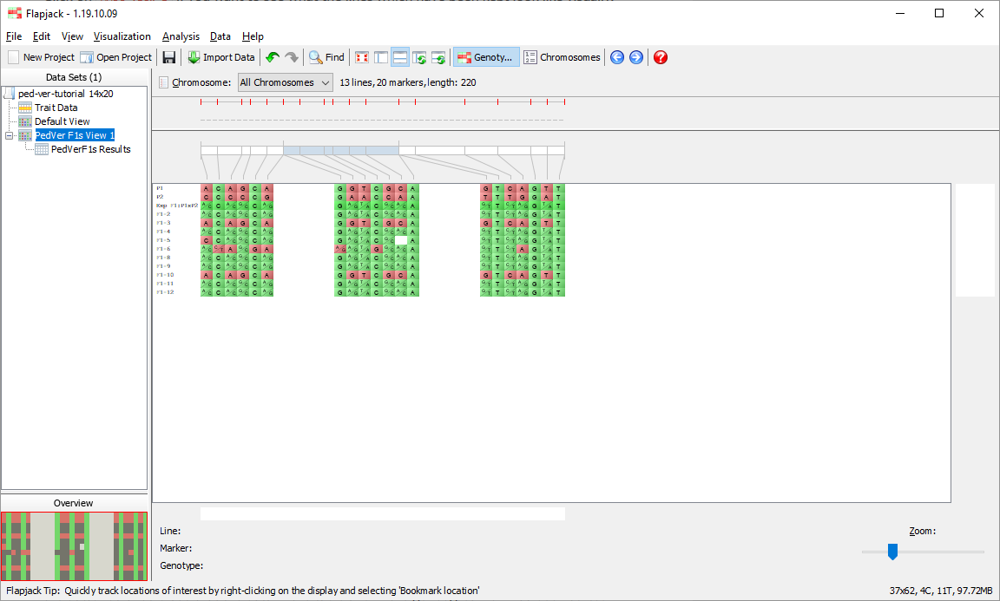
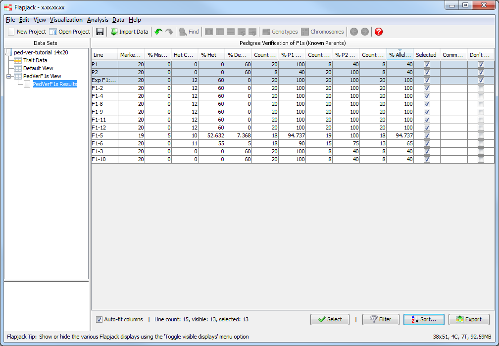
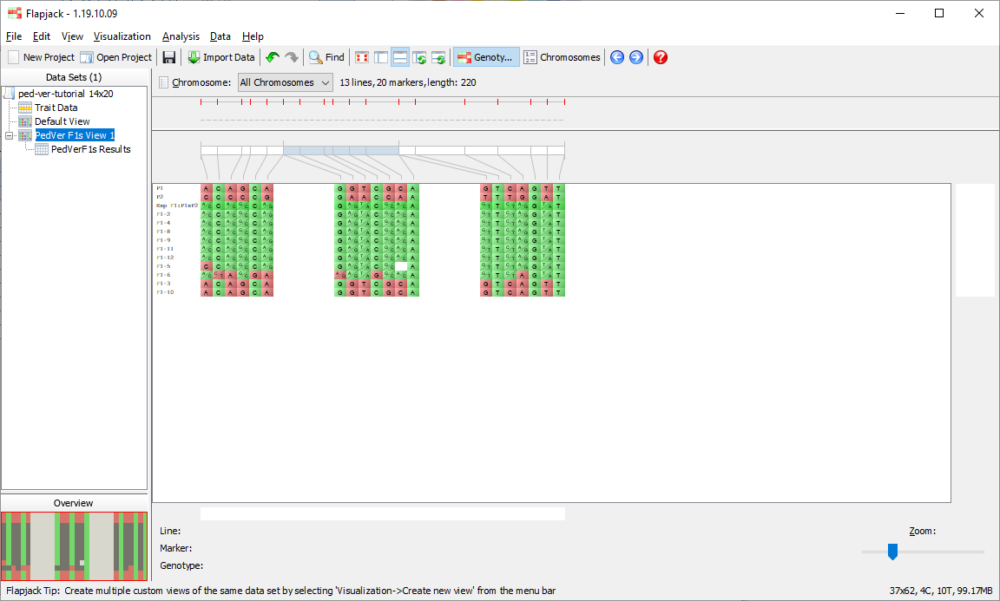
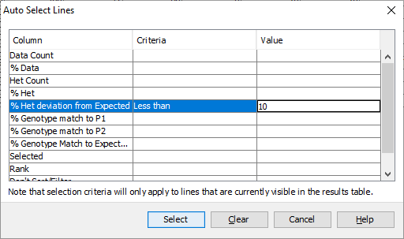
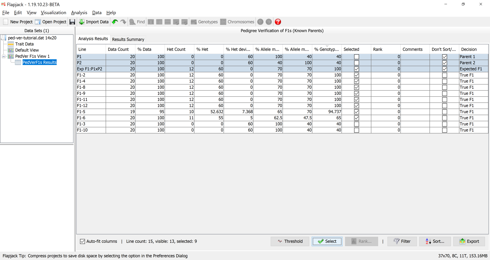
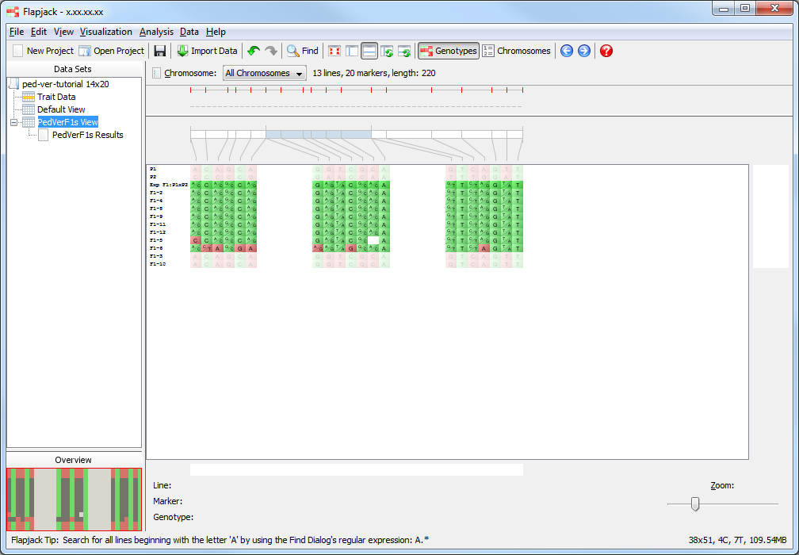
.. |018-export-results-to-file| image:: images/pedver_tut/018-export-results-to-file.png
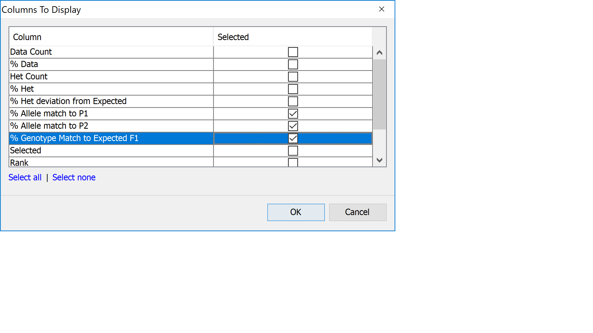
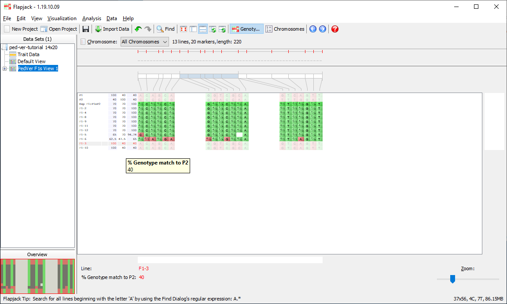
