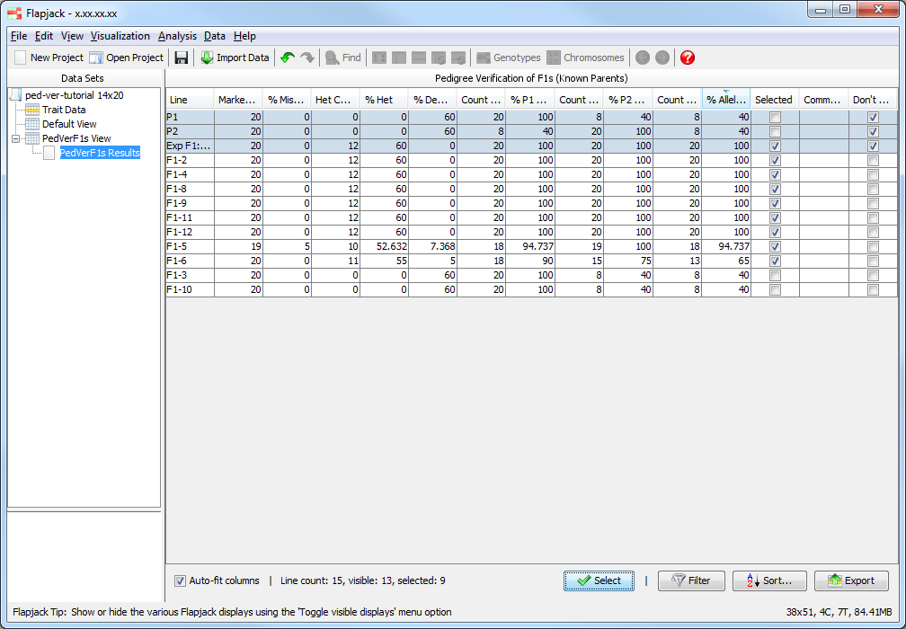
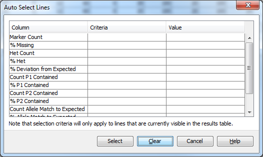
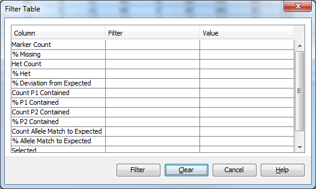
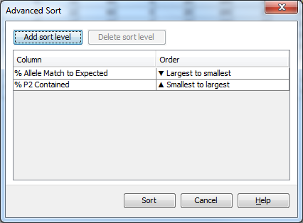
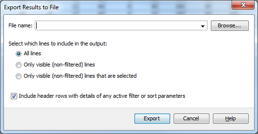

Analysis Results Tables
=======================

For certain types of analysis, such as :doc:`mabc` or :doc:`pedver_f1s_known_parents` Flapjack will present you with a results table. While the content of this table differs between analyses, you can interact with the table in the same way regardless of the analysis you have run. You can select, filter and sort lines, directly in the table, or through dialogs (for more complex options) and also export the data to a file.

This is a very powerful view because all lines shown in the table will reflect their sort order, filtered state, and selection state with the main visualization. This means you could, for example, sort the lines using the table and have that order reflected in the main view, or sort the main visualization and have that order automatically apply to the table.

 |AnalysisResultTable|

Note that you can right click anywhere on the table to access most of the options listed below.

Selecting lines
---------------

Select or deselect a single line by clicking the checkbox in the ``Selected`` column for that line.  To select all the lines in the results table, click the ``Select`` button at the bottom of the display and pick ``Select all``. To deselect all of the lines or invert the selection state of the lines use the ``Select none`` or ``Invert selection`` options respectively.

Auto selecting lines
--------------------

To select based on a set of criteria click the ``Select`` button and choose ``Auto select`` from the popup. This opens the ``Auto Select`` dialog, where you can specify criteria and values for the results table columns you wish to select on.

For numerical columns pick a criteria from the dropdown menu (eg less than or greater than or equal to) and type a value for that logic operation in the adjoining textbox.

For boolean (true/false) columns (shown as checkboxes in the main table), pick either true or false from the criteria dropdown menu - there is no need to provide a value in the adjoining textbox.

Finally, click ``Select`` to auto-select lines in the results table based on the options you have provided, or ``Clear`` to reset the options and start again.

 |AnalysisResultTableSelect|

Filtering lines
---------------

To filter lines based on a set of criteria, click the ``Filter`` button and pick ``Filter`` from the dropdown menu that appears. For each table column you wish to filter by, specify a filter type and a value. Filter types can be picked from the dropdown menu for each table column and comprise Less than, Less than or equal to, equal to, greater than or equal to, greater than, or, Does not equal filters. For each column you have specified a filter type you must also specify a value in the adjacent text field, unless the column you are filtering on contains a checkbox, in which case you can only pick from the filter types True and False and can’t supply a value.

Once you’ve set up your filters, you can click ``Filter`` which will apply the filters to the results table. You can also click ``Clear`` to reset the dialog to its default state, or ``Cancel`` to close without doing anything. If you decide you’d like to remove your filters and see all of the data again click ``Filter`` and select ``Reset filters`` from the dropdown that appears. 

 |AnalysisResultTableFilter|

Sorting lines
-------------

To sort a results table you can click the column header of the column you wish to sort by to apply a sort. In the first instance this will sort the table by ascending order of the values in that column. Click on the column header again to toggle the sort to order the table by descending order of the values in your chosen column. 

To sort by multiple columns at once click the ``Sort`` button on the results table view. In the ``Advanced Sort`` dialog pick the column you wish the primary sort to be on from the column dropdown and the order for the primary sort (either Largest to smallest or Smallest to largest). Click the ``Add sort level`` button and another set of dropdowns for column and sort order are added to the table. This allows you to sort by multiple columns, with any rows which contain the same value for the primary sort, are then ordered within themselves by the secondary (tertiary, n-ary…) sort order. As an example, in marker assisted backcrossing, if you’re primarily interested in lines which have a high QTL allele count value and secondarily in columns with a high RPP total value, you can add two sort levels select QTL allele count and Largest to smallest for the first sort level, then RPP total and Largest to smallest for the second sort level.

Highlight a sort level and click ``Delete sort level`` to remove any unwanted sort levels. Click ``Sort`` to apply the sort to the table, or ``Cancel`` to close the dialog without carrying out the sort. 

 |AnalysisResultTableSort|

Exporting to a file
-------------------

Click the ``Export`` button to open the ``Export Results to File`` dialog. Click ``Browse`` to select the location to save your file and your desired filename. Select the ``All lines`` option to export all of the table data (including lines which have been filtered out from the table), with the current sort order applied. Select the ``Only visible (non-filtered) lines`` option to export the table as you see it in the display. Select the ``Only visible (non-filtered) lines that are selected`` to export only the data which is visible in the table and has a tick in the selected column.  Pick if you wish to include details of any filtering and sorting which is active on the results in the table by ensuring the ``Include header rows with details of any active filter or sort parameters`` is selected. Click ``Export`` to export the table results to your chosen file, or click ``Cancel`` to close the dialog without exporting the data. 

 |AnalysisResultTableExport|

Ranking lines
-------------

Click and drag on the table to highlight the lines you wish to rank. Once highlighted, click the ``Rank`` button to open the ``Rank Lines`` dialog. Enter an integer value as the rank you wish to give the highlighted lines and click ``Ok`` to apply that rank to those results, or ``Cancel`` to close the dialog without ranking the results.

Don’t sort/filter
-------------------
When you run an analysis certain lines may be automatically marked as ``Don’t Sort/Filter`` lines. This means that any table based sorting or filtering won’t apply to those lines, in the case of sorting keeping these lines at the top of the table and in the case of filtering keeping them in the table even if they don’t match the filter criteria. To mark more lines that shouldn’t be sorted, or filtered, click the checkbox for those lines in the ``Don’t Sort/Filter`` column of the table. They won’t immediately move to the top of the table, but will do so the next time any sorting, or filtering occurs.

