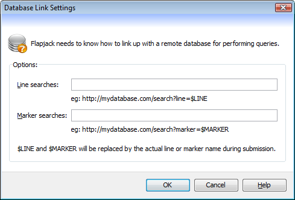

Database Link Settings
======================

Use the ``Database Link Settings`` dialog (``Data->query database->Settings``) to set or update the URLs that Flapjack will use when attempting to query a remote database for line or marker information.

 |DatabaseSettingsDialog|

* ``Line searches`` - enter a valid URL containing a location that can be queried for information on a line, where $LINE will be replaced by the actual name of the line.
* ``Marker searches`` - enter a valid URL containing a location that can be queried for information on a marker, where $MARKER will be replaced by the actual name of the line.

