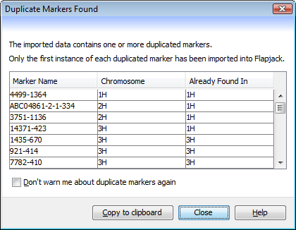

Duplicate Markers
=================

As data sets get larger, the potential for errors within them increases. Flapjack attempts to compensate for certain situations that may arise due to errors, one of them being detecting multiple instances of the same marker within a chromosome or sets of chromosomes when a data set is first imported.

If and when this happens, Flapjack will warn you via the ``Duplicate Markers Found`` dialog.

 |DuplicateMarkersDialog|

A marker within Flapjack is defined by its (case sensitive) name and only by its name. If another marker is found with the same name - either in the same or in a different chromosome - then Flapjack will ignore all instances of the marker `except` for the first instance it comes across.

Check the ``Don't warn me about duplicate markers again`` checkbox to have Flapjack import future data sets without warning you when duplicates are found (the duplicates will still be ignored by Flapjack though).

