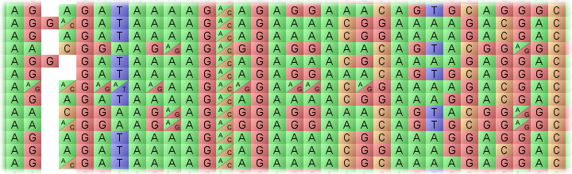
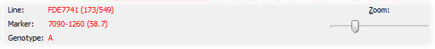
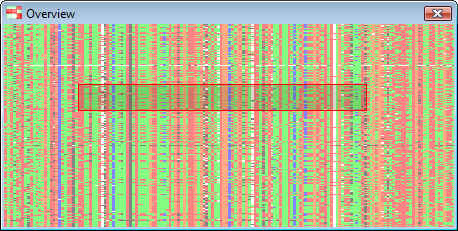
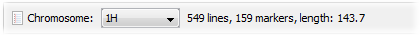
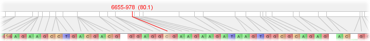
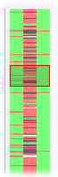
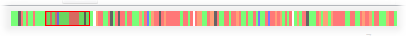

Genotype Visualization
======================

Flapjack's main display is all about genotype visualization. The screen is divided up into several separate areas, each one showing a different component of the various genotype-related visualizations.

.. note::
 This section of help only discusses genotype visualization. Please see the separate entries for help with :doc:`chromosome_visualization`, or :doc:`phenotype_visualization`.

Genotype display
----------------
 
The ``genotype display panel`` is the primary visualization component, showing a graphical representation of the genotype values for each homozygous (single block) or heterozygous (split diagonal block) allele within the current chromosome. Data on lines is shown horizontally, with data on the markers shown vertically. You can zoom in or out of the view by adjusting the zoom slider.

 |Alleles|
 
By default, Flapjack will show a colour per allele type. To overlay the underlying textual value, select ``Visualization->Overlay genotypes`` from the menu bar. Note that the colours in use are dependant on the :doc:`colour_schemes`.

Moving the mouse over any allele will provide more specific details about it in the lower information pane. This includes the name of the line currently under the mouse, the name of the marker currently under the mouse, and the value of the allele at that position.

 |ZoomPanel|
 
Chromosome overviews
--------------------
 
Depending on the zoom level, the main display may only be showing a subset of the available data for the current chromosome. A scaled-to-fit overview of the entire chromosome is visible in the bottom left corner of Flapjack's main window. This can also be popped out into its own window by selecting ``Visualization->Show overview``.

 |OverviewWindow|
 
The ``overview window`` displays all the data, with an inset region (marked in red) that represents how much of the data is currently visible within the main genotype display area.

.. note::
 Although the current colour scheme is maintained within the overview, for some schemes it is impossible for Flapjack to correctly render heterozygotes in an overview. In these cases, `all` such alleles are coloured in grey rather than their split diagonal colouring.
 
Line information
----------------
 
Information on each line is provided by the list of lines names that is displayed to the left-hand side of the genotype display area. As the mouse is moved over the genotypes, the current line's name will be highlighted in red within the list.

Chromosome display
------------------
 
 |ChromosomeSummary|
 
Flapjack displays one chromosome at a time from within a given data set. A drop down list of all available chromosomes can be found in the chromosome summary panel towards the top of the display area. This gives the name of the currently selected chromosome, along with a count of the number of active lines and markers within it, and its length in centimorgans (cM). (Active lines or markers refers to the number that are currently visible - see :doc:`selecting_lines_&_markers` for more information.)

Below the chromosome summary is a graphical representation of the chromosome map. This displays the chromosome itself, along with the positions of all its markers, and how each marker maps from the chromosome to the genotype display area within Flapjack.
 
 |ChromosomeMap|
 
As the mouse is moved over the genotypes, the current marker under the mouse is highlighted in red. Its name and position on the chromosome (in brackets) is displayed as well.

Line and marker overviews
-------------------------
 
The final elements of the visualization are the two overview displays; one for markers, shown to the right of the main genotype display; and one for lines, shown below the genotype display.
      
 |MarkerOverview| |LineOverview|

Each of these displays is active whenever the mouse is moved over the genotypes. The markers overview will display a scaled-to-fit visualization of all the data for the marker currently under the mouse, along with its two nearest neighbours. Similarly, the line overview will display a scaled-to-fit visualization of all the data for (just) the current line under the mouse.
 
As with the main overview display, each of these components will highlight what portion of the (entire) line or marker data is currently visible within the main genotype display by outlining that section within the overview.

