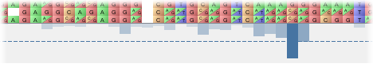
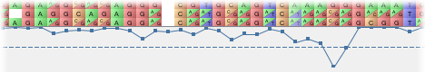

Graph Visualization
===================

Flapjack allows you to import "graphs" - which are files that contain one or more values per marker which can be visualized alongside the main display. Flapjack supports two style of graph - histogram and line graph.

 |GraphHistogram|

 |GraphLines|

Importing graph data
--------------------

Import a graph file using the ``Import Data`` dialog. Note that any graph data that is imported will overwrite any existing graph data held in the current data set, but the file format supports more than one graph anyway.

The structure of a graph file is tab-delimited text. Each line provides details on a marker via three columns in the following format:

::

 MarkerName      GraphName     Value

For example:

::

 11_20479        Height          10.5
 11_20480        Height           9.4
 11_20479        Resistance     0.234
 11_20480        Resistance     0.993
 ...

Each graph can also have an optional significance threshold value associated with it. This is specified by using the reserved "SIGNIFICANCE_THRESHOLD" keyword in the file, for example:

::

 SIGNIFICANCE_THRESHOLD    Height     8.0
 11_20479                  Height    10.5
 ...

Interacting with a graph
------------------------

You can select which graph to display, along with the type of graph (line or histogram) by using the ``Select Graph`` dialog.

When you mouse over a graph, the status panel will show you:

* the name of the marker currently under the mouse
* the name of the graph
* the value of the marker (and optionally the graph's threshold value in parenthesis)

When displaying a histogram, the intensity of the colour is used to represent the value; the stronger the colour, the higher the value.

If a graph has a significance threshold, then this will be displayed on the graph as a dotted line.

