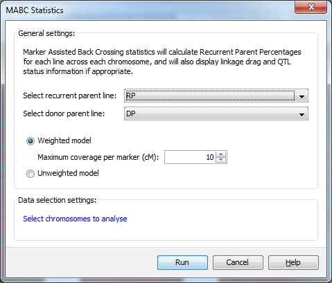
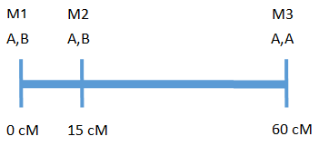
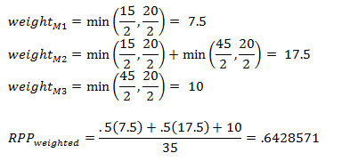
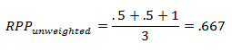
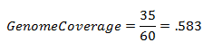
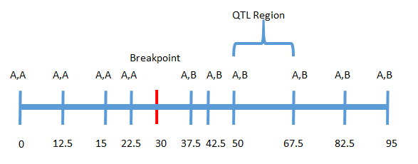

Marker Assisted Back Crossing
=============================

Marker Assisted Back Crossing statistics will calculate Recurrent Parent Percentages for each line across each chromosome, and will also display linkage drag and QTL status information if appropriate.

You can run an MABC analysis by selecting ``Analysis->Marker assisted back crossing`` from the menubar.

 |MABCStatsDialog|

Using the ``MABC Statistics`` dialog you can select both the recurrent and donor parents with which to run a marker assisted back crossing analysis. You can also choose to use a ``Weighted model`` which specifies the maximum length of genome a marker can accurately represent in the analysis, or an ``Unweighted model`` which doesn't take the amount of genome represented by each marker into consideration.

In addition to this help page, you can also read the :doc:`mabc_tutorial`, which runs through the process of running the analysis and viewing the results with a sample dataset.

MABC QTL format
---------------

To generate linkage drag statistics as part of the marker assisted backcrossing analysis, you must provide a QTL file in addition to your genotype and map data. This QTL file differs from the standard Flapjack QTL file as it requires an additional column of data to be able to make use of the data in the analysis.

The format of your QTL file should resemble the example below:

::

 # fjFile = QTL
 Name  Chromosome  Position  Minimum  Maximum  Trait   Experiment  ``Source``  [optional_1] .. [optional_n]
 QTL1  1H          10        8        12       Height  Exp1        ``DP``       25.5            high
 QTL2  1H          20        19       26       Height  Exp1        ``DP``       34.8            low
 QTL3  2H          10        8        13.5     Temp    Exp1        ``DP``       99.2            low

The **Name** to **Experiment** columns are required and must be included and listed in the order shown. After that, each QTL may have zero or more optional columns of numerical or textual data that can be included too. The **Source** column is required for linkage drag statistics to be provided. Flapjack will look for values of DP, and RP, indicating that the alleles we're looking for are coming from either the donor parent, or the recurrent parent.

Recurrent parent proportion (RPP) calculations
----------------------------------------------

There are two methods for calculating RPP, weighted and unweighted. To illustrate the difference, take the hypothetical chromosome below with three markers:

 |MABCHypoChromosome|

The above chromosome has a length of 60 cM with 3 markers, where A is the recurrent parent genotype and B is the donor parent genotype.

Weighted calculation
--------------------

In the weighted calculation the user specifies the maximum length of genome a marker can accurately represent. For example, if 20 cM is chosen, each marker can accurately represent 10 cM on either side of the marker for a total of 20 cM.

Weights for each marker are determined by taking the minimum of half the distance between the marker and the adjacent marker or half the maximum coverage. Taking the example above:

The distance between M1 and M2 = 15 cM - 0 cM = 15 cM

The distance between M2 and M3 = 60 cM - 15 cM = 45 cM

 |MABCWeightedCalcs|

For the calculation of RPP the weights for markers 1 and two are multiplied by .5 because they are heterozygous and marker 3 is multiplied by 1 because it is homozygous for the recurrent parent. The sum of these values is divided by the total coverage (sum of the weights for each marker).

Unweighted calculation
----------------------

In the unweighted calculation the amount of genome being represented by each marker is not taken into consideration. For the above example the RPP would be:

 |MABCUnweightedCalcs|

In this example the RPP calculations do differ as the weights for each marker are not the same. The degree to which the calculations will differ depends on how evenly markers are spaced across the genome. It should be noted that, if no map is provided, the weighted calculation will give effectively the same results as the unweighted calculation.

Genome Coverage
---------------

Genome coverage only applies to the weighted RPP calculation. It provides a measure of how much of the genome is covered given the maximum coverage allowed for each marker. In the above example, where maximum length of genome a marker can cover is 20 cM, the genome coverage would be:

 |MABCGenomeCoverage|

Linkage Drag(LD) Calculations
-----------------------------

LD is calculated as the length of donor genome linked to the QTL region. This is done by looking for the first recombination on each side of the QTL region and calculating the genome length between the QTL and each breakpoint. Below is an example to illustrate the calculation:

 |MABCLinkageDrag|

In this example a break point occurred at approximately 30 cM on the left side of the QTL region and no break point occurred on the right side. In this case linkage drag is calculated by summing the distance between the breakpoint and the left boundary of the QTL region and the distance between the end of the chromosome and the right boundary of the QTL region:

**LD** = (50 - 30) + (95 - 67.5) = 47.5

