Pedigree Verification (F1s Known Parents) Tutorial
==================================================

In this tutorial we will assume that you are using the ``ped-ver-tutorial`` dataset, which contains simulated data with two parent lines and twelve F1s that we'd like to test against these parental lines to see if they are likely to be derived from the parental lines. You'll be working with two files, a map file (ped-ver-tutorial.map) which contains a set of 20 markers across 3 chromosomes and a genotype file (ped-ver-tutorial.dat) which contains data on a set of 14 lines (two of which are parents, 12 of which are putative F1s).

Download the data (Right click->Save Link As):

* `ped-ver-tutorial.map`_
* `ped-ver-tutorial.dat`_

Importing data
--------------

To import data into Flapjack click the ``Import Data`` button on the toolbar. In the ``Import Data`` dialog, select the ``Maps and Genotypes`` tab, then click ``Browse`` to navigate to and select the map file you wish to import (ped-ver-tutorial.map), and then do the same for the genotype file you wish to import (ped-ver-tutorial.data).

 |001-pv-import-data|

Click the ``Advanced options`` button to open the ``Advanced Data Import Options`` dialog and ensure that the ``Duplicate all markers onto a single “All Chromosomes” chromosome for side by side viewing`` option is selected, then click OK. Finally click the ``Import map/genotypes`` button to load the data.

You should now be viewing the Default View on the 1st chromosome of your dataset. This is the main type of visualization in Flapjack and comprises a graphical genotype view of the imported data. Each square represents an allele, found at the cross-section of a line and a marker, lines or varieties can be found down the left hand side of the display and markers can be found along the top (as well as a visualization of the map associated with the markers). Alleles can be either homozygous (in this dataset either an A or a B) or heterozygous, with the latter being rendered as split diagonal blocks, or A/B in the dataset.

 |002-pv-initial-default-view|

If you’re used to viewing heterozygous alleles as simply H instead of a diagonal split view, select ``Visualization->Colour scheme->Customize`` from the menubar to open the ``Customize Colours`` dialog. From there you can select ``Always render heterozygotes as single-colour 'H' blocks, regardless of the scheme selected`` option and click ``Apply to current view`` - your heterozygotes should now be rendering as a single-colour 'H' block.

 |005-hets-as-h|

Select the All Chromosomes view from the Chromosome dropdown menu underneath the toolbar and use the zoom control at the bottom of the display to zoom out until you can see all of the data. You should now see a representation of all three chromosomes in the dataset.

 |003-pv-loaded-all-chromosomes|

Note the colour of the "map" alternating between white and blue. The "map" for the ``All Chromosomes`` view is a combination of the other maps with ticks which extend above the map to show the start and end of each real map within the "map" of the ``All Chromosomes`` view. Every second map is also coloured light blue to make it easier to differentiate between maps on the ``All Chromosomes`` view.

Exploring and filtering data
----------------------------

To navigate the data select ``Edit->Navigation mode`` from the menubar, then click and drag the main display around with your mouse to examine all of your data. You can also use the scrollbars to navigate the data, as well as clicking and dragging on the overview in the bottom left. To zoom you can either use the zoom slider in the bottom left of the display, double click on the main display to zoom in, or use ctrl /cmd and the mouse’s scroll-wheel to zoom in and out.

Before you run a marker assisted backcrossing analysis, you may want to filter out markers with lots of missing data, or monomorphic markers. Select ``Edit->Filter markers->Missing markers`` to open the ``Filter Missing Markers`` dialog. Choose the percentage of missing data in a marker required to filter out a marker, then use the ``Filter`` button to perform the operation. You should see a message detailing the number of markers that were filtered out of the dataset as part of the operation.

.. note::
 In the case of the sample dataset none will be filtered out as no markers have a high percentage of missing data in the simulated dataset.

The procedure for filtering monomorphic markers is very similar - select ``Edit->Filter markers->Monomorphic markers``, and simply apply the filter once the dialog has opened.

It’s also possible to filter out markers which have missing (or heterozygous) data in a given line. To do this, right click on a line of interest and and select ``Filter markers->Missing markers (by line)`` to open the ``Filter Missing Markers by Line`` dialog. The line should be pre-selected in the dropdown menu. Click ``Filter`` and Flapjack will remove any markers which have missing data for this line from the display.

Running the analysis
--------------------

Select ``Analysis->Pedigree verification->F1s (known parents)`` to open the ``Pedigree Verification - F1s (Known Parents)`` dialog. Select the first parent line for your data from the first drop down list and the second parent line from the second drop down list. The drop down lists automatically select the first and second lines of the genotype input file, so if as in the tutorial data set, your two parents are on the first and second lines of the input file they will be automatically selected. Select ``Simulate an F1 from the parents (above)`` as with the tutorial data set we don't have an expected F1 in our data. The simulated F1 is generated by looking at each allele of the parents and deciding what an F1 created from these two lines would have at that allele. We use a simple model such that if either parent has missing or heterozygous data for an allele that allele has missing data in the simulated F1. If we did have an expected F1 in our data set we would select ``Select an F1 from the existing lines`` and choose our expected F1 from that dropdown list. 

 |004-pv-analysis-dialog|

Click ``Run`` and Flapjack will run the analysis.

Viewing the analysis results
----------------------------

Once the analysis has completed you should see a table of results. The results table will contain the lines that you included in the analysis, for each line it will have a marker count, percentage of missing alleles, count of heterozygous alleles, percentage of heterozygous alleles, percentage deviation from the expected F1, count of match to parent 1 alleles, percentage match to parent 1 alleles, count of match to parent 2 alleles, percentage match to parent 2 alleles, count of allele match to the expected F1, percentage of allele match to the expected F1, as well as a selected state, and comment. The final column - Don't Sort / Filter - allows you to mark lines that you don't want table sorts and filters to apply to. By default, Flapjack sets both of the parents, and the expected F1 to neither sort, nor filter. This has the effect of keeping them in the display and always at the top of the table of data.

 |005-pv-analysis-results|

You should see that not only has Flapjack generated this ``PedVerF1s Results`` view, but it has linked this to a new view called ``PedVerF1s View``. Click ``PedVerF1s View`` to view it and you should see that it's a clone of the ``Default View``, but has the ``By similarity to line (2 colour)`` colour scheme applied. This colour scheme colours a reference line all green, all other lines have their alleles coloured either green, if they match the reference line, or red, if they don't match the reference line. In this particular case the alleles will be coloured relative to the simulated F1 you created when you ran the pedigree verification F1s (known parents) analysis. This view ``PedVerF1s View`` is linked to the table in the ``PedVerF1s Results`` view. That means moving lines, sorting lines, selecting lines and hiding lines on ``PedVerF1s View`` does the same in the linked ``PedVerF1s Results`` view, and sorting lines, selecting lines and filtering lines in the ``PedVerF1s Results`` view does the same in the linked view ``PedVerF1s View``.

 |006-pv-pedverf1s-view|

Filtering the results
---------------------

Click on ``PedVerF1s Results`` to return to the results view. Next click ``Filter->Filter`` to open the ``Filter Table`` dialog. You should see a table with a list of columns from the table on which you can filter. Click on the filter column for the row called ``% Missing`` and select ``Less than`` from the drop down list. Next enter a value of ``50`` in the adjacent ``Value`` column, then click ``Filter``. 

 |007-pv-filter-dialog|

You should see that the results table has filtered out lines which didn't match the filter criteria. 13 of the 15 lines matched the criteria.

 |008-pv-filtered-results|

Click on ``MABC View 1`` if you want to see what the lines which have been kept look like visually.

 |009-pv-filtered-genotypes|

Sorting the results
-------------------

Return to the results table and select ``Sort`` to use the ``Advanced Sort`` dialog. Click ``Add sort level`` to add another entry to the table. Click the first entry in the ``Column`` column and select ``% Allele Match to Expected`` from the drop down list that appears. For the next entry select ``% P" Contained``. For the last entry change its ``Order`` to be ``Smallest to largest``. Click ``Sort`` to sort the data. You should see that the data in the table and in the genotypes view has been sorted according to your criteria.

 |010-pv-sorted-results|

 |011-pv-sorted-genotypes|

Selecting within results
------------------------

Click ``Select->Auto select`` to open the ``Auto Select Lines`` dialog. Fill the dialog in as with the ``Filter`` dialog, with values for ``% Deviation from Expected`` of ``Less than`` ``10``. Click ``Select`` to apply the selection criteria to the data in the results table. You may see a dialog informing you that Flapjack has switched to line mode. Click Ok to dismiss this. Then view the results of your selection in both the results and genotype views. You should note that there are now only 15 lines selected. Deselected lines are de-emphasised in the genotype view in Flapjack by ligthening their colour. 

 |012-pv-auto-select-lines|

 |013-pv-selected-results|

 |014-pv-selected-genotypes|

Exporting results
-----------------

Click ``Export`` to open the ``Export Results to File`` dialog. You can select three separate types of export from this dialog, ``All lines`` which exports all of the data whether it had been filtered or not, ``Only visible (non-filtered) lines`` which outputs the results table as it appears in Flapjack, and ``Only visible (non-filtered) lines that are selected`` which outputs only the lines which are visible in the table and are selected. Select the third option: ``Only visible (non-filtered) lines that are selected``. Ensure that the ``Include header rows with details of any active filter or sort parameters`` is selected, this outputs information about the filtering and sort that was applied to reach the current view of the data, which can be useful for the purpose of reproducing the steps at a later date. Click ``Browse`` to select a location to save your file, as well as a file name. Finally click ``Export`` to output the data to file.

 |018-export-results-to-file|

You can view the contents of the file in any text editor.

Viewing results in the genotype view
------------------------------------

Return to the genotype view of the data (``PedVerF1s View``) and zoom in until you can comfortably read the line names which are just to the left of the genotype visualization. Right-click on the list of line names and select ``Show table results`` from the menu to open the ``Columns To Display`` dialog. This dialog allows you to select columns of data from the results table to view side by side with the genotype data. This can be good for a final visual validation of what you're seeing from the analysis results. Select ``% P1 Contained``, ``% P2 Contained``, and ``% Allele Match to Expedted`` by clicking the corresponding checkboxes in the dialog, then click ``OK``.

 |015-pv-columns-to-display|

 |016-result-linked-to-genotypes|

You should see that there are three extra columns of data between the lines names and the genotype display. These are the four columns you selected in the ``Columns To Display`` dialog and represent the data found for those columns for the lines in ``PedVerF1s Results`` view. Mouseover the columns to see tooltips with the column name and value for the line under the mouse, this information is also displayed in the status panel at the bottom of the display. Here we can see that one of the lines we've deselected has a value of % P1 Contained of 100%, but only 40% for % P2 Contained and % Allele Match to Expected. This suggests that the line under the mouse is a self of parent 1.

Conclusion
----------

You've now had a chance to experiment with running a markers assisted backcrossing analysis in Flapjack and analysing the results of that analysis. Feel free to experiment more by applying different sorts, filters, selections, or better yet make a start on analysing your own data.

.. _`ped-ver-tutorial.map`: http://bioinf.hutton.ac.uk/flapjack/sample-data/tutorials/ped-ver-tutorial.map
.. _`ped-ver-tutorial.dat`: http://bioinf.hutton.ac.uk/flapjack/sample-data/tutorials/ped-ver-tutorial.dat

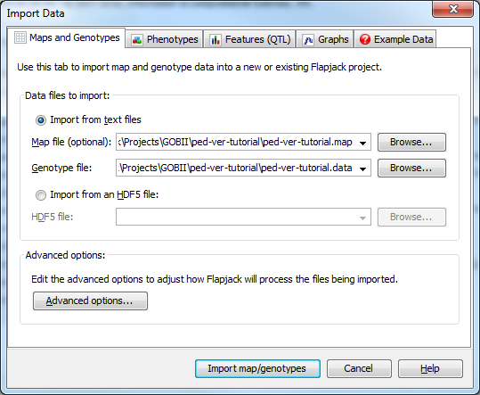
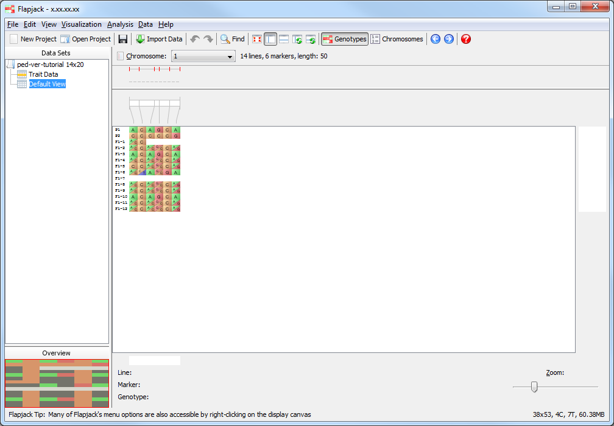
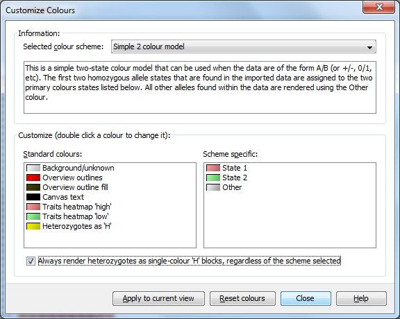
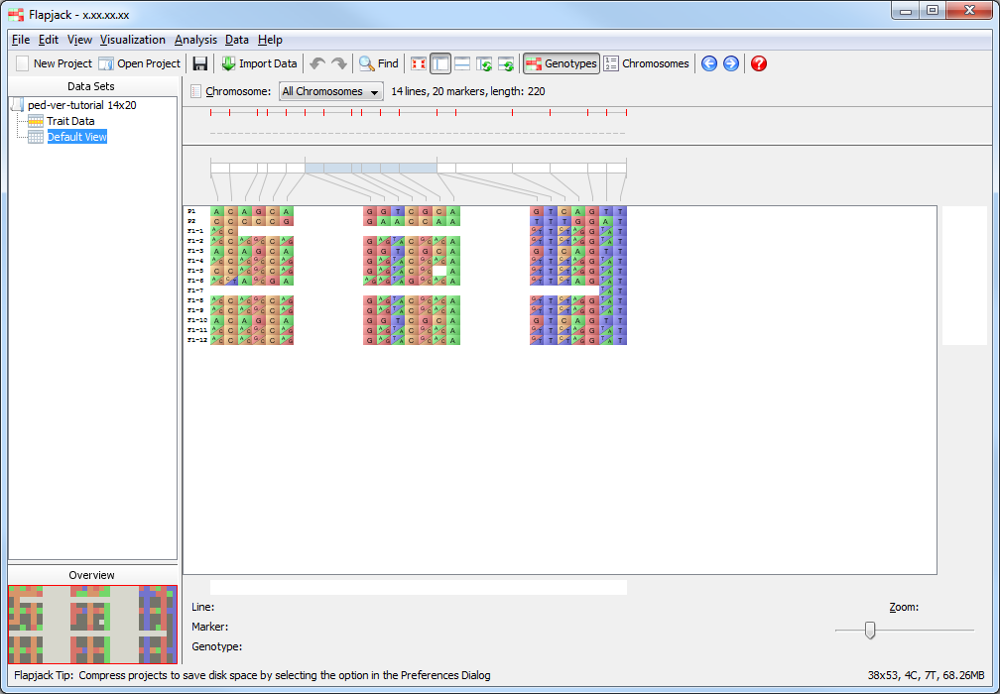
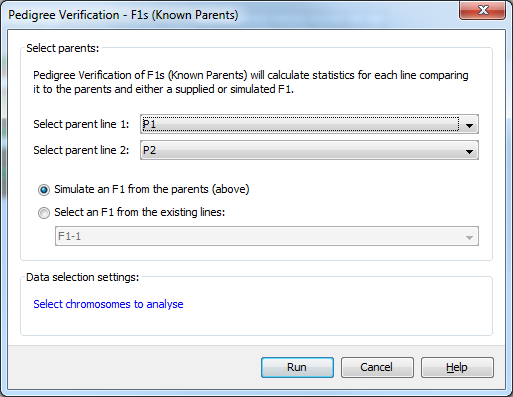
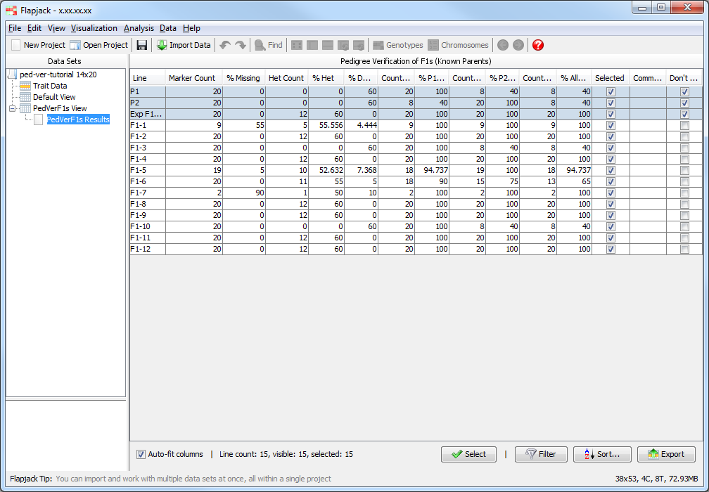
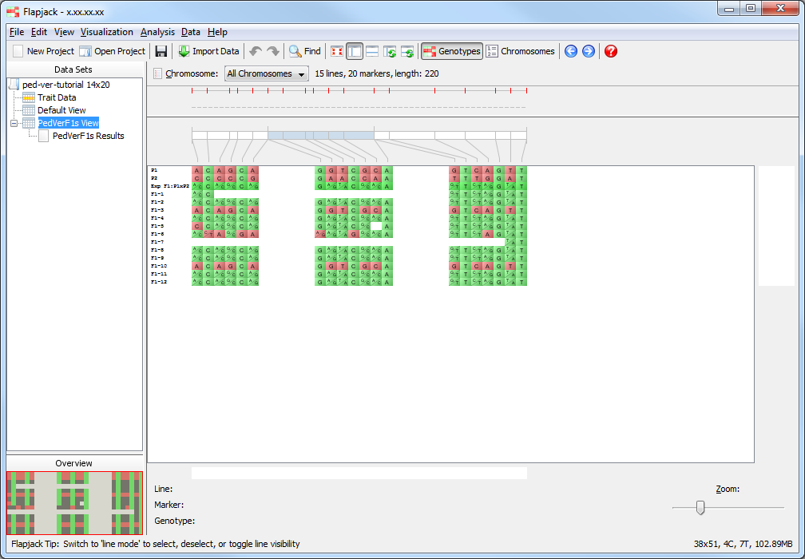
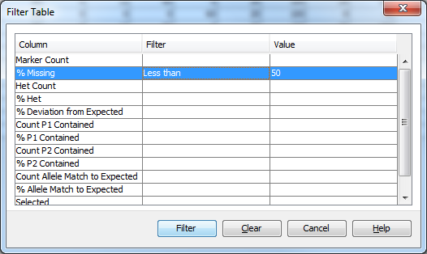
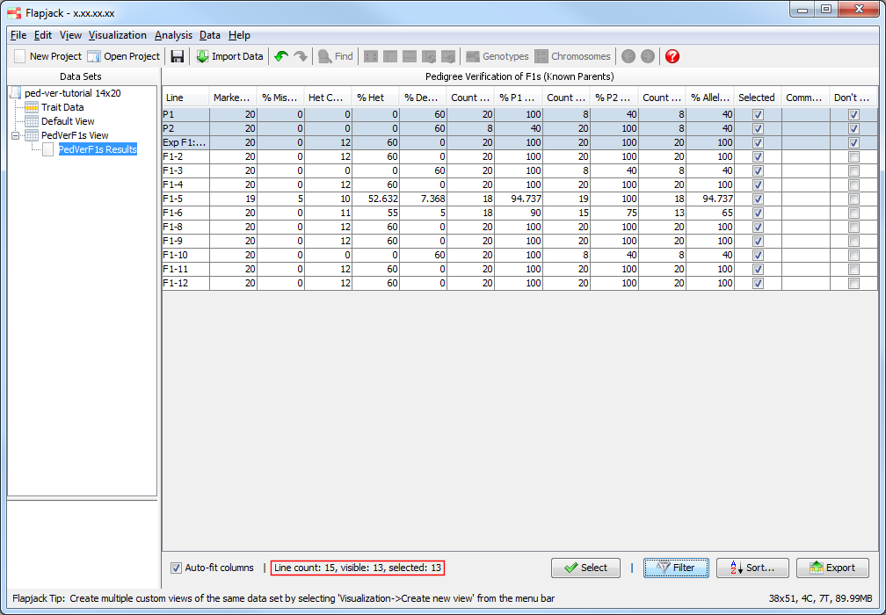
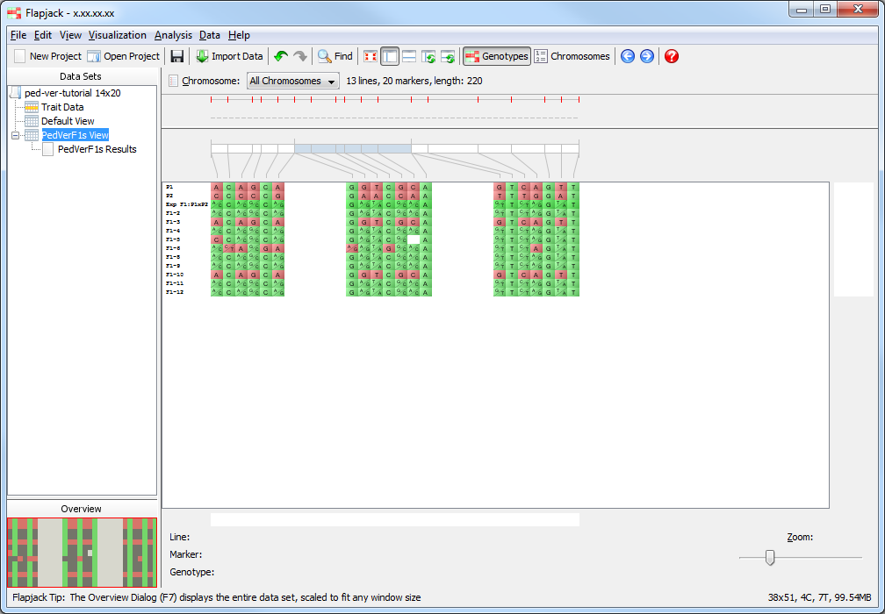
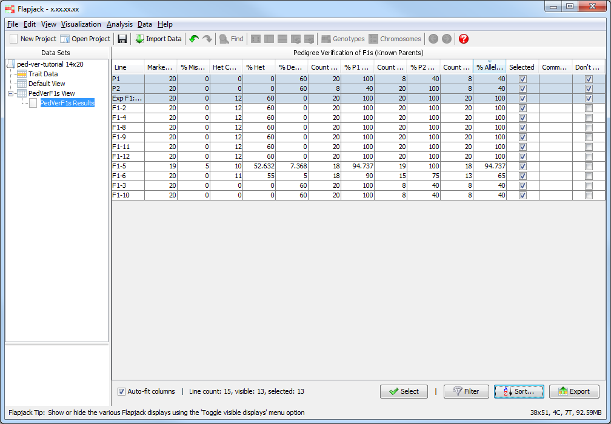
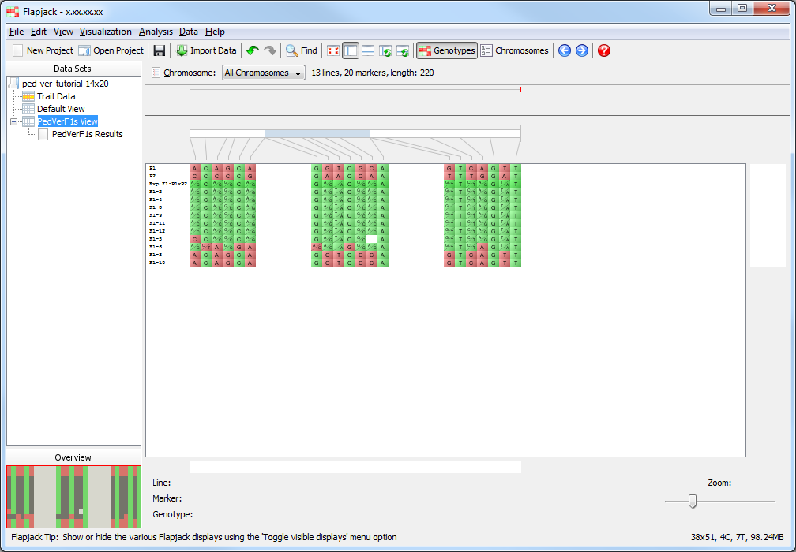
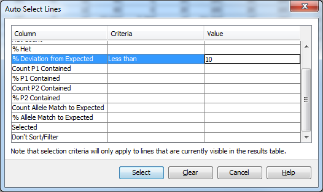
.. |013-pv-selected-results| image:: images/pedver_tut/013-pv-selected-results.png
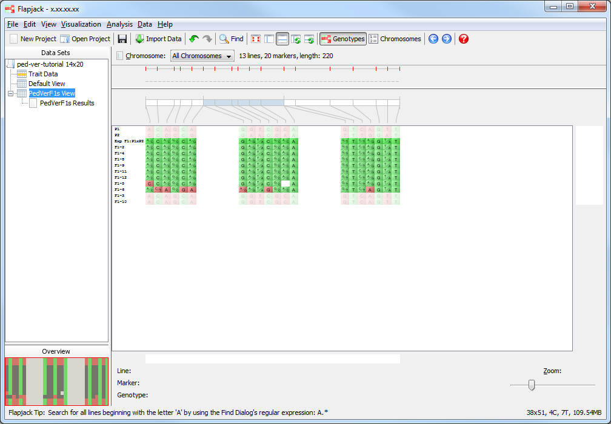
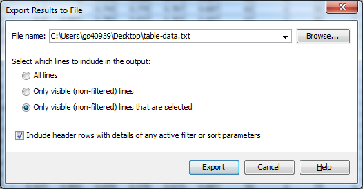
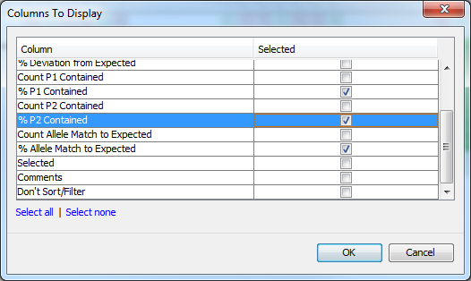
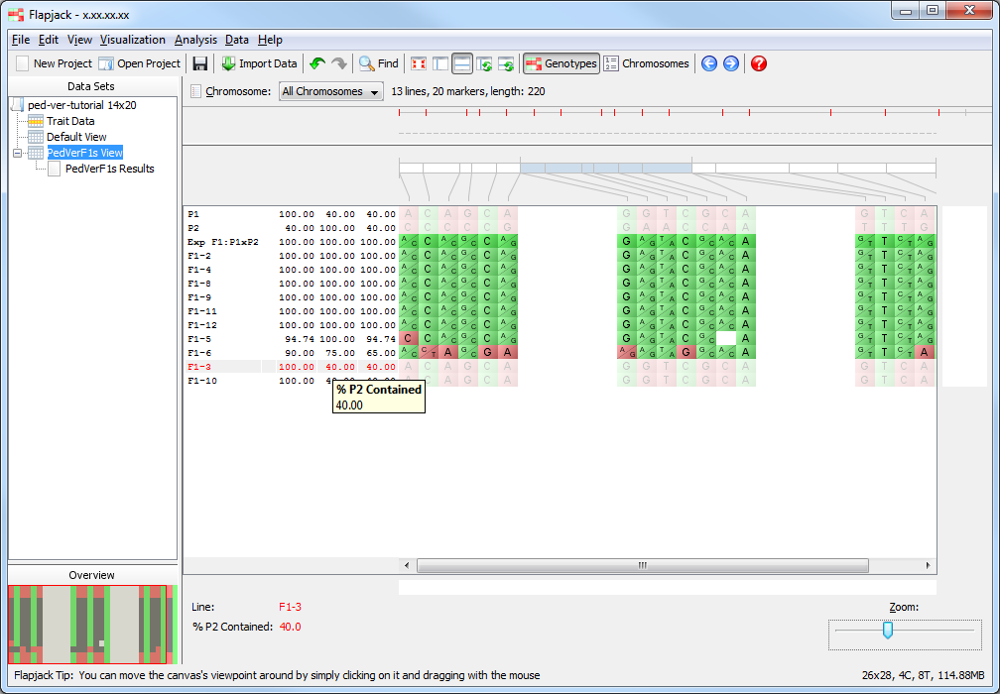