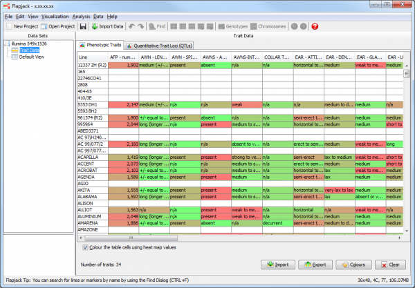
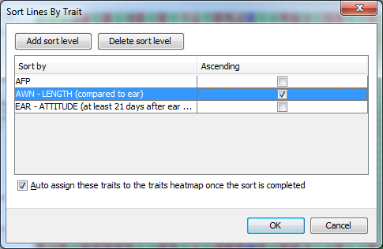

Phenotype Visualization
=======================

Flapjack can import supplementary phenotype (trait) data that is associated with the genotype data set. 

Importing phenotypic data
-------------------------

To import phenotype data into Flapjack, open up the ``Import Data`` dialog and select the ``Phenotypes`` tab where you can choose the file to import.

Phenotypes can be imported from files containing the following tab-delimited format:

::

 # fjFile = PHENOTYPE
              Trait1       Trait1       Trait2
              Experiment1  Experiment2  Experiment1
 Line1        50           High         Short
 Line2        2.3          High         Medium
 Line3        99.3         Low          Long

Trait data for a single trait can be either numerical or categorical. The line containing experiment information for each trait is `optional`.

Phenotype summary information
-----------------------------

One the phenotypes are imported, Flapjack will display a summary table of the data within the ``Trait Data`` node associated with the main data set. This is a matrix of data with lines down the left hand side and phenotypes across the top of the display. Each intersection of a line and a phenotype represents a phenotype value. 

 |TraitDataView|

By default the phenotypes values are displayed in a heatmap format, with green representing low values and red representing high values. These colours can be changed either Flapjack wide, or for a specific trait by clicking the ``Colours`` button on the ``Phenotypic Traits`` tab of the ``Trait Data`` view and selecting new colours from the ``Trait Colours`` dialog.

Visualizing alongside genotype data
-----------------------------------

When you load phenotypic data into Flapjack, Flapjack selects the first three traits found in the file and displays them in a heatmap next to the main graphical genotype display. To select which phenotypes are in the heatmap, select ``Data->Select traits`` to open the ``Select Traits`` dialog. Select the traits you wish to display next to the lines in the genotype view, then click ``OK``.

Sorting by phenotype
--------------------

Sort the lines by your phenotypic data by right clicking on a phenotype and choosing ``Sort A-Z`` or ``Sort Z-A`` when you have categorical data loaded, or ``Sort smallest to largest``' or ``Sort largest to smallest`` when you have numerical phenotype data loaded. You can also carry out an advanced sort by selecting ``Analysis->Sort lines->By trait``. 

 |SortLinesByTrait|

This type of sort allows you to sort by one trait first, then for lines which share values for that trait you can sort within those by a secondary trait and so on. By default the dialog will display a sinle trait to sort by and whether or not the sort will be in ascending order. You can add these secondary (tertiary, n-ary) sorts by clciking the ``Add sort level`` button. If you decide to remove a sort level, simply click on the row you wish to remove then select ``Delete sort level``. Note the ``Auto assign these traits to the traits heatmap once the sort is completed`` checkbox. If this is checked it will automatically display the traits used to carry out your sort next to the genotypes.

