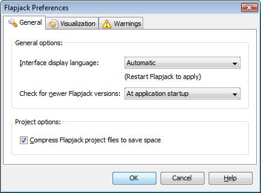
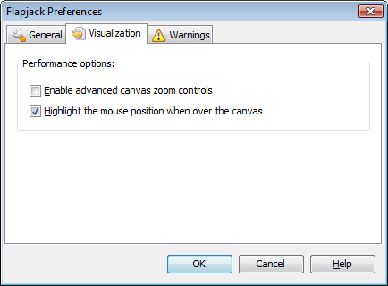
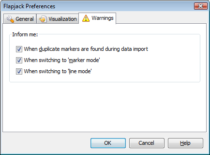

Preferences
===========

The ``Preferences`` dialog (``Help->Preferences``) can be used to modify various settings that affect the way Flapjack is used and is displayed.

General
-------

 |PreferencesDialogGeneral|

* ``Interface display language`` - this setting determines what language Flapjack will display its user interface in. ``Automatic`` will attempt to pick the most suitable language based on your operating system's settings. If this is not correct, or you wish to use another language, you can also select from ``English (UK)``, ``English (US)`` , or ``German``. Flapjack will need to be restarted after any changes are made.
* ``Check for newer Flapjack versions`` - this setting determines how often Flapjack will attempt to connect back to its download server to see if a newer version is available. The options available are ``Never``, ``At application startup``, ``Once a day``, ``Once a week``, and ``Once a month``.
* ``Compress Flapjack project files to save space`` - toggles on or off project compression. By default, project files are zip-compressed which significantly reduces the final file size, however, with very large data sets this may increase the time taken to save and/or load projects.

Visualization
-------------

 |PreferencesDialogVisualization|

* ``Enable advanced canvas zoom controls`` - selecting this option will change the standard "zoom" control option for zooming in and out of the display into separate horizontal and vertical zoom controls. This gives more control of the display but may reduce the effect of some visualizations. Use with caution.
* ``Highlight the mouse position when over the canvas`` - selecting this option will graphically highlight the line and the marker currently under the mouse cursor's position as it is moved over the main display area.

Warnings
--------

Flapjack can inform you when certain events take place. Once you are used to these events, you may wish to stop further reminders. These options allow for this.

 |PreferencesDialogWarnings|

* ``When duplicate markers are found during data import`` - every marker (and line) within a data set imported into Flapjack must be unique. In the case of markers, Flapjack will continue to import the data even after a duplicate marker has been found, however it will only use the first instance that it came upon. Selecting this option will cause Flapjack to display the ``Duplicate Markers`` dialog that informs you if duplicates are found.
* ``When switching to 'marker mode'`` - selecting this option will cause Flapjack to remind you that you are now working in marker mode (along with brief instructions) if a switch is made to marker mode.
* ``When switching to 'line mode'`` - selecting this option will cause Flapjack to remind you that you are now working in line mode (along with brief instructions) if a switch is made to line mode.

