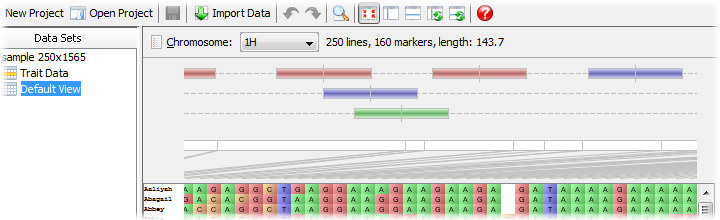
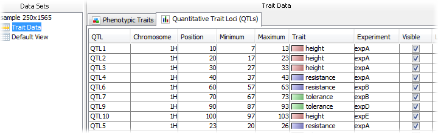
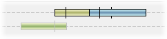
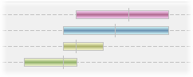
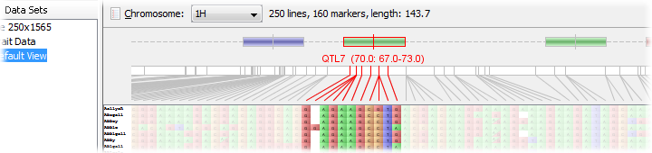

QTL Visualization
=================

Flapjack can import supplementary QTL (quantitative trait locus) data that is associated with the main map and genotype data set. Flapjack supports multiple QTLs per chromosome, displayed over multiple ''tracks'' per chromosome.

 |QTLs|

Each QTL can be colour-coded to the trait it is associated with, and ultimately used to select or de-select groups of markers within the main display.

Importing QTL data
------------------

To import QTL data into Flapjack, open up the ``Import Data`` dialog and select the ``Features (QTL)`` tab.

QTLs can be imported from files containing the following tab-delimited format:

::

 # fjFile = QTL
 Name  Chromosome  Position  Pos-Min  Pos-Max  Trait   Experiment  [optional_1] .. [optional_n]
 QTL1  1H          10        8        12       Height  Exp1        25.5            high
 QTL2  1H          20        19       26       Height  Exp1        34.8            low
 QTL3  2H          10        8        13.5     Temp    Exp1        99.2            low

The **Name** to **Experiment** columns are required and must be included and listed in the order shown. After that, each QTL may have zero or more optional columns of numerical or textual data that can be included too, for example, LOD scores, r :sup:`2` values, etc.

QTL summary information
-----------------------

Once the QTLs are imported, Flapjack will display a summary table of the data within the ``Trait Data`` node associated with the main data set. This lists each QTL, along with its values, and also provides a checkbox to set its `visible` state, that is, whether that QTL should be displayed or not.

 |QTLSummaryTable|

If any QTLs are not completely on the chromosome map they are associated with, Flapjack will refuse to make them visible and will tag them with a red X in the summary table.

Displaying QTLs
---------------

To ensure the QTLs are displayed on the main visualization area, check the settings in the ``Toggle Visible Displays`` dialog and check the ``QTL panel`` option. The display of QTLs is common across all views for a data set - you cannot have a custom set of QTLs per view (unlike lines or markers).

QTLs are displayed along the top of the map with their exact position being marked by a small vertical bar. Their left and right error margins are shown by the overall size of the box itself. Each QTL will be colour-coded by trait.

Mouse-over any QTL to see further information on it, including its name and position values, trait, experiment, and any further optional data that may have been included in the import file.

The number of visible tracks can be adjusted by dragging the slider below the QTLs either up or down. If there is is not enough room to display all the QTLs at a given location, Flapjack will collapse them together, and will outline the group in black. To ensure that all QTLs are visible, drag the slider lower to open more tracks until all black outlines have been removed.

 |BlackQTLs| |NoBlackQTLs|

Interacting with QTLs
---------------------

To move a QTL between tracks, hold down the CTRL key and drag it with the mouse to the new track. Flapjack will remember any custom positioning across the tracks, but only so long as you leave the number of tracks the same. If you change the number of active tracks used for displaying QTLs, then a new layout will be created for them, losing any changes you may have made.

To select or deselect markers that are within the map region of a given QTL, simply click the QTL with the mouse. Flapjack will automatically change to ``marker mode`` and toggle the selection state of any relevant marker.

 |QTLSelection|

Filtering visible QTLs
----------------------

To filter which QTLs are visible, you can either manually select or deselect each QTL using the summary table, or open up the :doc:`filter_qtls` dialog that allows you to perform an automatic filter based on each QTL's associated trait and experiment value.

