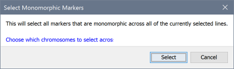

Selecting Lines and Markers
===========================

Flapjack works on the assumption that all lines and markers - when first visualized - are selected; that is, they are drawn in a normal state and are available for use if any of the analysis tasks are run (for example filtering markers from view). Deselected lines or markers are drawn in a fainter colour (see below) and are ``always excluded`` from any analysis. For more on this see :doc:`modes_&_views`.

Marking selections
------------------

To select or deselect lines or markers in Flapjack, first ensure you are in the correct mode - either ``Line mode`` for selecting lines or ``Marker mode`` for selecting markers. Certain operations - for example selecting monomorphic markers - will switch to the correct mode for you.

Clicking on an individual line or marker will toggle its selection state on or off. You can also click-drag across multiple lines or markers at once to set their selection state.

There are also several options within the ``Edit->Select lines`` and ``Edit->Select markers`` menu options, allowing you to select all, select none, invert the current selection state, or even to import a custom selection order from a text file. The format of these files is simply one line or marker per line of the file, with any lines or markers found being set to selected. Any lines or markers missing from the file will be left as deselected.

Selecting monomorphic markers
-----------------------------

Flapjack contains a special selection dialog that can automatically select all monomorphic markers across all of the currently selected lines. This option can be found within ``Edit->Select markers->Select monomorphic...`` menu.

 |MonomorphicMarkers|

