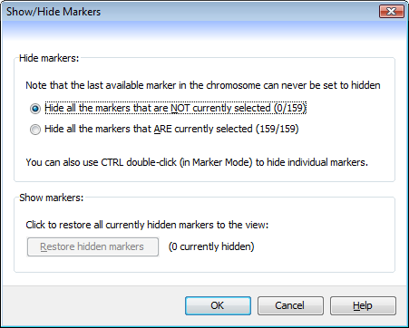

Show/Hide Markers
=================

You can use the ``Show/Hide Markers`` dialog (``Edit->Show/hide markers``) to control which markers are visible within the current view. Options are provided that allow you to hide existing markers, or to restore previously hidden markers so that they become visible again.

 |HideMarkersDialog|

Hiding markers
--------------

Flapjack offers three methods of hiding markers, two of which are available via this dialog:

* ``Hide all the markers that are NOT currently selected`` - selecting this method will hide markers that are not part of the currently selected set (these markers will be shown faded on the main display).
* ``Hide all the markers that ARE currently selected`` - selecting this method will hide markers that are part of the currently selected set.

To visually see which markers are selected or not, ensure Flapjack is in Marker Mode before opening the ``Show/Hide Markers`` dialog.

The third method of hiding markers is available for quickly hiding a single marker only. CTRL (or CMD on macOS) double-click a marker on the canvas while in Marker Mode, and it will be removed from the visible set.

Restoring markers
-----------------

Markers that have been previously hidden can be restored to the view by clicking the ``Restore hidden markers`` button (which will only be enabled if there are actually markers available to be restored).

Note that when restoring markers, Flapjack will search for the best location to restore each marker to the view, but there will be cases when a marker will not return to the same location it had originally. This can happen for several reasons:

* If the marker shares the exact same chromosome position with one or more other markers. For example, consider the markers A, B, and C, all located at the same position on the chromosome. Marker B is set to hidden, then restored. The marker order after restoration could be ABC, BAC, or ACB - each is equally valid.
* If other (still visible) markers have been moved around the view. Flapjack uses the chromosome position to determine where to reinsert a marker, but if the marker order has been changed, these positions become unusable.

